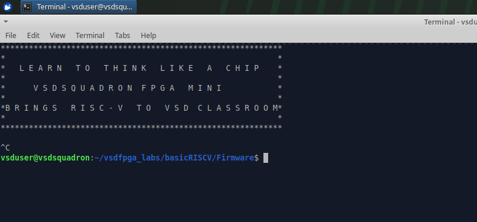
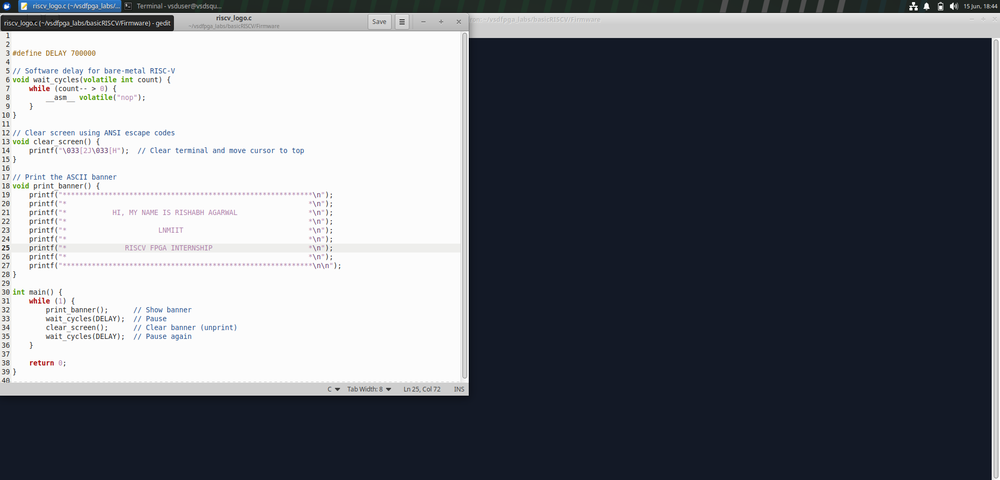
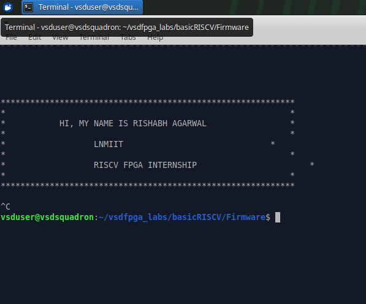

# RISC-V-Internship
## Basic Details
**Name:** Rishabh Agarwal<br>
**College:** The LNM Institute of Information Technology<br>
**Email ID:** 24uec246@lnmiit.ac.in<br>
**GitHub Profile:** [Rishabh-Github](https://github.com/Rishabh-ece?tab=repositories)<br>
**LinkedIn Profile:** [Rishabh-LinkedIn](https://www.linkedin.com/in/rishabh-agarwal-ece/)<br>

---

<details>
<summary><b>Task 1 :</b> Compilation of C Program using GCC and RISC-V GCC Compiler</summary>
<br>

This task demonstrates how to compile a simple C program using both the native GCC compiler and the RISC-V GCC compiler. The objective is to understand the compilation flow and observe the generated RISC-V assembly instructions.

---

# C Language Compilation using GCC

## Step 1: Navigate to Working Directory

```bash
cd /workspaces/vsd-riscv2/
cd samples
```

## Step 2: Create the C File

Open the terminal and navigate to your working directory. Create a new C source file using:

```bash
gedit sum_1ton.c
```

## Step 2: Write the Program

Write a program to calculate the sum of numbers from 1 to n.


Save the file using `Ctrl + S`.

## Step 3: Compile and Execute using GCC

```bash
gcc sum_1ton.c
./a.out
```


---

# RISC-V GCC Compilation

## Step 1: Display the C Program

```bash
cat sum_1ton.c
```


## Step 2: Compile using RISC-V GCC Compiler

```bash
riscv64-unknown-elf-gcc -O1 -mabi=lp64 -march=rv64i -o sum_1ton.o sum_1ton.c
```

This cross-compiles the C source for the 64-bit RISC-V architecture using `-O1` optimization, generating an ELF object file with RISC-V machine instructions.

## Step 3: Generate Assembly Dump

```bash
riscv64-unknown-elf-objdump -d sum_1ton.o
```

`objdump -d` reverse-translates the binary into human-readable RISC-V assembly.


## Step 4: View Assembly in `less` and Search for `main`

```bash
riscv64-unknown-elf-objdump -d sum_1ton.o | less
```

Inside `less`, type `/main` to jump directly to the `main` function.

### `-O1` Optimization — 15 Instructions in `main`

With `-O1`, the compiler applies basic optimizations. The `main` function contains **15 instructions**.


### `-Ofast` Optimization — 12 Instructions in `main`

```bash
riscv64-unknown-elf-gcc -Ofast -mabi=lp64 -march=rv64i -o sum_1ton.o sum_1ton.c
```

With `-Ofast`, the compiler applies aggressive optimizations, reducing `main` to just **12 instructions**.


---

# `-O1` vs `-Ofast` — Key Differences

| Feature | `-O1` | `-Ofast` |
|---|---|---|
| **Optimization Level** | Basic | Aggressive / Maximum |
| **Instructions in `main`** | 15 | 12 |
| **Code Size** | Slightly reduced | Further reduced |
| **Standard Compliance** | Fully compliant | May relax IEEE/C standard |
| **Risk** | Very low | Edge-case math may differ |
| **Best Used For** | Development & debugging | Performance-critical builds |

---

# Conclusion

This task provided a hands-on understanding of the complete compilation pipeline — from writing a C program to analyzing its RISC-V assembly. By compiling with both GCC (native) and the RISC-V cross-compiler, we observed how high-level C code translates into architecture-specific instructions.

The comparison between `-O1` and `-Ofast` clearly illustrated the impact of compiler optimizations: `-O1` produced **15 instructions** in `main`, while `-Ofast` reduced this to **12 instructions**. This highlights a key trade-off in embedded systems — **correctness vs. performance** — and understanding it is essential for anyone working with RISC-V or low-level development.

</details>

---

<details>
<summary><b>Task 2.1 :</b> SPIKE Simulation and Debugging using RISC-V GCC</summary>
<br>

This task demonstrates execution and debugging of a RISC-V compiled C program using the **SPIKE** simulator. Both `-O1` and `-Ofast` optimization levels are explored and compared.

---

## Step 1: Navigate to Working Directory

```bash
cd /workspaces/vsd-riscv2/
cd samples
```

---

## Step 2: Compile and Run using GCC (Native)

```bash
gcc sum1ton.c
./a.out
```

Then compile using RISC-V GCC and simulate with SPIKE:

```bash
riscv64-unknown-elf-gcc -Ofast -mabi=lp64 -march=rv64i -o sum1ton.o sum1ton.c
spike pk sum1ton.o
```

Both produce the same output, confirming correctness of the RISC-V binary.


---

## Step 3: Assembly of `<main>` — `-Ofast` vs `-O1`

### `-Ofast` — 12 Instructions

```bash
riscv64-unknown-elf-gcc -Ofast -mabi=lp64 -march=rv64i -o sum1ton.o sum1ton.c
riscv64-unknown-elf-objdump -d sum1ton.o | less
```

Search `/main` to jump to the `<main>` function.


### `-O1` — 15 Instructions

```bash
riscv64-unknown-elf-gcc -O1 -mabi=lp64 -march=rv64i -o sum1ton.o sum1ton.c
riscv64-unknown-elf-objdump -d sum1ton.o | less
```


`-Ofast` reduces `main` from **15 → 12 instructions** by aggressively eliminating redundant operations.

---

## Step 4: Debugging with SPIKE (`-d` flag)

Open the interactive SPIKE debugger:

```bash
spike -d pk sum1ton.o
```

### Debugging `-Ofast` build

Navigate to `<main>` at address `100b0`:

```bash
until pc 0 100b0
```

| Command | Instruction | Register | Before | After |
|---|---|---|---|---|
| `reg 0 a2` | `lui a2, 0x1` | `a2` | `0x0000000000000000` | `0x0000000000001000` |
| `reg 0 a0` | `lui a0, 0x21` | `a0` | — | `0x0000000000021000` |
| `reg 0 sp` | `addi sp, sp, -16` | `sp` | `0x000000007f7e9b50` | `0x000000007f7e9b40` |


### Debugging `-O1` build

Navigate to `<main>` at address `10184`:

```bash
until pc 0 10184
```

| Command | Instruction | Register | Before | After |
|---|---|---|---|---|
| `reg 0 sp` | `addi sp, sp, -16` | `sp` | `0x000000007f7e9b50` | `0x000000007f7e9b40` |
| `reg 0 a2` | `li a2, 45` | `a2` | — | `0x000000000000002d` |
| `reg 0 a1` | `li a1, 9` | `a1` | — | `0x0000000000000009` |


---

## Key Observations

- **`lui` (Load Upper Immediate):** Loads a value into the upper 20 bits of a register — used in `-Ofast` to build addresses/constants efficiently.
- **`li` (Load Immediate):** Loads a full immediate value directly into a register — more common in `-O1`.
- **`addi sp, sp, -16`:** Allocates 16 bytes of stack space at function entry — identical in both builds.
- Stack pointer changes identically in both: `0x7f7e9b50` → `0x7f7e9b40`.

---

## Conclusion

This task provided hands-on experience with RISC-V simulation and instruction-level debugging using SPIKE. By comparing `-O1` and `-Ofast`, it was observed that aggressive optimization reduces `main` from 15 to 12 instructions using more compact sequences (e.g., `lui` instead of `li`). Register tracing confirmed how values are loaded and how the stack pointer is managed at function entry — key concepts in understanding RISC-V calling conventions and processor execution flow.

</details>

---
<details>
  <summary><b>Task 2.2 :</b> Traffic Light Controller Simulation — RISC-V GCC & SPIKE</summary>
  <br>

---

## 📋 About the Project

This project simulates a **2-road Traffic Light Controller** using a **Finite State Machine (FSM)** in C. It cycles through 4 states representing real-world traffic light logic.

| State | Road A | Road B |
|-------|--------|--------|
| 0 | 🟢 Green | 🔴 Red |
| 1 | 🟡 Yellow | 🔴 Red |
| 2 | 🔴 Red | 🟢 Green |
| 3 | 🔴 Red | 🟡 Yellow |

---

## 🛠️ Step-by-Step Workflow

### Step 1 — Navigate to Working Directory

```bash
cd /workspaces/vsd-riscv2/
cd samples
```

---

### Step 2 — Write the C Program

The source code was written using **gedit** text editor inside the codespace environment.

```bash
gedit traffic_light.c
```


---

### Step 3 — Compile and Run with Native GCC

```bash
gcc traffic_light.c
./a.out
```


---

### Step 4 — Compile with RISC-V GCC (Create Object File)

The C code is cross-compiled for RISC-V architecture using the following command:

```bash
riscv64-unknown-elf-gcc -O1 -mabi=lp64 -march=rv64i -o traffic_light.o traffic_light.c
ls -ltr traffic_light.o
```


> The `ls -ltr` confirms the object file `traffic_light.o` was successfully created (168136 bytes).

---

### Step 5 — Run on SPIKE Simulator

```bash
spike pk traffic_light.o
```


> Output is **identical** to native GCC — confirming the RISC-V binary works correctly on SPIKE.

---

### Step 6 — Objdump Analysis

Disassemble the binary to see the RISC-V assembly instructions:

```bash
riscv64-unknown-elf-objdump -d traffic_light.o | less
```

Search for main inside `less`:
```
/main
```

---

#### 🔷 Objdump with `-O1`


From the screenshot above, `main` starts at address **`0x10184`**.


`main` ends at **`0x102C8`**. Using the calculator shown:

```
Number of Instructions = (End Address − Start Address) / 4
                       = (0x102C8 − 0x10184) / 4
                       = 0x144 / 4
                       = 324 / 4
                       = 81 instructions
```

> Each RISC-V instruction = **4 bytes**, so we divide the byte difference by 4.

---

#### 🔶 Objdump with `-Ofast`


`main` starts at address **`0x100B0`**.


`main` ends at **`0x10214``. Using the calculator:

```
Number of Instructions = (0x10214 − 0x100B0) / 4
                       = 0x164 / 4
                       = 356 / 4
                       = 89 instructions
```

---

#### 📊 Comparison Table

| Flag | Start Address | End Address | Instructions |
|------|--------------|-------------|--------------|
| `-O1` | `0x10184` | `0x102C8` | **81** |
| `-Ofast` | `0x100B0` | `0x10214` | **89** |

---

#### ⚖️ Why does `-Ofast` have MORE instructions than `-O1`?

| Property | `-O1` | `-Ofast` |
|----------|-------|----------|
| Code size | Smaller (81 instr.) | Larger (89 instr.) |
| Execution speed | Moderate | Faster |
| Loop handling | Keeps original loop | May unroll loops |
| Stack allocated | 96 bytes | 112 bytes |

**Reason:** `-Ofast` applies aggressive techniques like **loop unrolling** (writes loop iterations explicitly instead of branching) and **function inlining** (prepares arguments inline instead of calling). This adds more instructions but eliminates branch penalties — so it runs faster even with more code.

> Analogy: `-O1` packs your bag normally. `-Ofast` unpacks and reorganizes everything for fastest access — uses more space but you grab things quicker.

---

### Step 7 — SPIKE Debug Mode

SPIKE's `-d` flag lets you step through every RISC-V instruction one by one — like watching your C code run at the hardware level.

```bash
spike -d pk traffic_light.o
```

---

#### 🔷 Debug with `-O1`

```bash
(spike) until pc 0 10184     # jump to start of main
(spike) reg 0 sp             # check stack pointer value
(spike)                      # press Enter to step instruction by instruction
```


**Key instructions visible in `-O1` debug:**

| Instruction | What it does |
|-------------|-------------|
| `addi sp, sp, -96` | Allocates 96 bytes on stack for local variables |
| `sd ra, 88(sp)` | Saves return address — so main knows where to go back |
| `sd s0, 80(sp)` | Saves registers that will be used inside the function |
| `jal ra, <puts>` | Calls `puts`/`printf` to print the traffic light state |
| `addiw s0, s0, 1` | Increments loop counter (`state++`) |
| `j <main+0xb0>` | Jumps back to top of loop |

---

#### 🔶 Debug with `-Ofast`

```bash
(spike) until pc 0 100b0     # jump to start of main (-Ofast address)
(spike) reg 0 sp
(spike)
```


**Key differences in `-Ofast` debug:**

| Instruction | What it does |
|-------------|-------------|
| `lui a0, 0x21` | Loads string address **before** stack setup (aggressive reordering) |
| `addi sp, sp, -112` | Stack is **larger (112 bytes)** — more variables due to inlining |
| `addi a0, a0, 912` | Combines address calculation in fewer steps |
| `sd ra, 104(sp)` | Return address saved at higher offset (bigger stack frame) |

> Notice `-Ofast` starts by loading the string address (`lui`) even **before** allocating the stack — this is the compiler reordering instructions to keep the CPU pipeline busy.

---

#### 🔄 Side-by-Side Debug Difference

| | `-O1` | `-Ofast` |
|-|-------|----------|
| Main start address | `0x10184` | `0x100B0` |
| First instruction | `addi sp, sp, -96` | `lui a0, 0x21` |
| Stack size | 96 bytes | 112 bytes |
| Style | Conservative, readable | Aggressive, reordered |

---

## 🧰 Tools Used

| Tool | Purpose |
|------|---------|
| `gedit` | Writing C source code |
| `gcc` | Native x86 compilation and testing |
| `riscv64-unknown-elf-gcc` | Cross-compilation for RISC-V |
| `spike` | RISC-V ISA simulator |
| `pk` | Proxy kernel — minimal OS for SPIKE |
| `objdump` | Disassemble binary to RISC-V assembly |
| GitHub Codespaces | Cloud development environment |

---

## 📌 Key Learnings

1. Same C code → **different assembly** depending on the optimization flag.
2. `-Ofast` produces **more instructions** than `-O1` but runs **faster** due to loop unrolling and inlining.
3. Every RISC-V instruction = **4 bytes** → instruction count = address difference / 4.
4. The **function prologue** (`addi sp`, `sd ra`) and **epilogue** (`ld ra`, `ret`) are clearly visible in both objdump and debug.
5. `spike -d` is a powerful way to trace how C code maps to real hardware instructions.

---
</details>

----

<details>
<summary><b>Task 3 :</b> Environment Setup & RISC-V Reference Bring-Up</summary>
<br>
This task establishes the RISC-V + FPGA development environment and verifies the complete reference execution flow. It ensures the toolchain and simulation environment are properly configured before proceeding with FPGA and IP-level work.
 
 
---
 
## 🎯 Objective
 
Successfully configure the development environment and validate the RISC-V reference flow by compiling and executing sample programs, then clone and build the VSDFPGA labs firmware.
 
**This task focuses on:**
- Toolchain verification and readiness
- Understanding the RISC-V compilation and firmware flow
- Running the VSDFPGA labs in simulation (without FPGA hardware)
- Building a stable foundation for upcoming internship tasks
---
 
## 🖥️ Environment Used
 
| Environment | Purpose |
|---|---|
| GitHub Codespace (`sturdy-doodle`) | Primary development — Steps 1, 2, 3 |
| Oracle VirtualBox VM (Ubuntu) | Local setup verification — Step 4 |
 
---
 
## Step 1: Set Up GitHub Codespace
 
The official **vsd-riscv2** repository was forked from [https://github.com/vsdip/vsd-riscv2](https://github.com/vsdip/vsd-riscv2) to my GitHub account and a Codespace was launched directly from the fork.
 
The Codespace initialized and built successfully, providing a pre-configured Linux environment with all required RISC-V development tools already installed — including `riscv64-unknown-elf-gcc` and the Spike ISA simulator. No manual tool installation was needed.
 
**Repository forked:** `Rishabh-ece/vsd-riscv2` | **Codespace name:** `sturdy-doodle`
 
---
 
## Step 2: Verify RISC-V Reference Flow
 
### 2.1 — Confirm Toolchain Version
 
The RISC-V cross-compiler version was verified to confirm the toolchain is correctly installed.
 
```bash
riscv64-unknown-elf-gcc --version
```
 
The output confirmed **SiFive GCC 8.3.0-2019.08.0**, proving the compiler is ready.
 

 
---
 
### 2.2 — Navigate to Samples Directory
 
```bash
cd /workspaces/vsd-riscv2
cd samples
ls -ltr
```
 

 
---
 
### 2.3 — Compile and Run the Reference Program
 
The `sum1ton.c` program was compiled and executed two ways — native GCC first, then via the RISC-V cross-compiler and Spike simulator — to verify the full toolchain end-to-end.
 
```bash
# Native GCC
gcc sum1ton.c
./a.out
 
# RISC-V cross-compilation + Spike simulation
riscv64-unknown-elf-gcc -o sum1ton.o sum1ton.c
spike pk sum1ton.o
```
 
Both produced identical output:
 
```
Sum from 1 to 9 is 45
```
 
This confirms the RISC-V binary is functionally correct and the toolchain is fully working.
 

 
---
 
## Step 3: Clone and Run VSDFPGA Labs
 
### 3.1 — Clone the VSDFPGA Labs Repository
 
Once the RISC-V reference flow was verified, the VSDFPGA Labs repository was cloned into the Codespace.
 
```bash
git clone https://github.com/vsdip/vsdfpga_labs
cd vsdfpga_labs
```
 
 

 
---
 
### 3.2 — Review the Firmware Source: `riscv_logo.c`
 
The firmware source was inspected using `cat` to understand the program's structure before building it.
 
```bash
cd ~/vsdfpga_labs/basicRISCV/Firmware
cat riscv_logo.c
```


 
---
 
### 3.3 — Generate the BRAM Hex File
 
The firmware was compiled to produce `riscv_logo.bram.hex` — the memory initialization file embedded into the FPGA's Block RAM (BRAM).
 
```bash
make riscv_logo.bram.hex
```
 
The `make` command drives the full pipeline:
 
1. Cross-compiles `riscv_logo.c` → `riscv_logo.o` using `riscv64-unknown-elf-gcc`
2. Assembles support files: `start.S`, `putchar.S`, `wait.S`, `perf.S`
3. Links all objects using `bram.ld` → produces `riscv_logo.bram.elf`
4. Runs `firmware_words` to convert the ELF binary → `riscv_logo.bram.hex`
5. Copies the hex file into `../RTL/` for use in the FPGA build

 
---
 
### 3.4 — BRAM Hex Generation Output
 
The build completed successfully with these key metrics:
 
```
RAM SIZE=6144
Code size: 780 words ( total RAM size: 1536 words )
Occupancy: 50%
SAVE HEX: riscv_logo.bram.hex
```
 
The firmware uses exactly **50% of the available BRAM**, leaving headroom for future additions. The hex file was automatically placed in `RTL/firmware.hex` and `RTL/obj_dir/firmware.hex`.
 

 
---
 
## Step 4: Local Machine Preparation (Oracle VirtualBox VM)
 
To prepare for future FPGA hardware tasks that require local execution, the development environment was replicated on an **Oracle VirtualBox VM** running Ubuntu. Both repositories were cloned locally, and the same build flow was verified.
 
```bash
ls ~
# vsdfpga_labs  vsd-riscv2  VSDSquadron_FM  vsd_ss  ...
```
 
The home directory listing confirms both `vsdfpga_labs` and `vsd-riscv2` are present on the local machine alongside other project directories.
 

 
---
 
### 4.1 — Inspect Firmware Using Nano on VM
 
Inside the VM, `riscv_logo.c` was opened with `nano` to inspect the firmware and verify the local environment is functional.
 
```bash
cd ~/vsdfpga_labs/basicRISCV/Firmware
nano riscv_logo.c
```
 
The complete source was visible — `print_banner()`, delay loop, `clear_screen()`, and `main()` — confirming the file was cloned correctly.
 

 
---
 
### 4.2 — Generate BRAM Hex Locally on VM
 
The firmware was also built locally to verify the VM toolchain works correctly, independent of the Codespace.
 
```bash
make riscv_logo.bram.hex
```
 
The local build succeeded with **51% BRAM occupancy**, confirming the local environment is fully operational for future tasks.
 

 
---
 
## 🧠 Understanding Check — Mandatory Questions
 
### Q1: Where is the RISC-V program located in the `vsd-riscv2` repository?
 
The RISC-V reference program is located in the **`samples/`** directory of the `vsd-riscv2` repository. The primary file is `sum1ton.c`, which calculates the sum of integers from 1 to N. Supporting files include `load.S` (assembly bootloader), `1ton_custom.c` (a variant), and a `Makefile` for build automation.
 
```
vsd-riscv2/
└── samples/
    ├── sum1ton.c       ← Main reference program
    ├── load.S          ← Assembly bootloader
    ├── 1ton_custom.c   ← Custom variant
    └── Makefile        ← Build script
```
 
---
 
### Q2: How is the program compiled and loaded into memory?
 
The process follows two steps:
 
**Step 1 — Cross-Compilation:**
```bash
riscv64-unknown-elf-gcc -o sum1ton.o sum1ton.c
```
The C source is compiled by the RISC-V cross-compiler into a RISC-V binary (ELF format). This binary contains RISC-V machine instructions and cannot run on a native x86 PC — it needs a RISC-V processor or simulator.
 
**Step 2 — Loading and Simulation via Spike + Proxy Kernel:**
```bash
spike pk sum1ton.o
```
- **Spike** is a software RISC-V CPU — it simulates the processor in its entirety.
- **pk (Proxy Kernel)** is a minimal OS shim that loads the binary into simulated memory, sets up the execution environment, and handles system calls like `printf`.
```
sum1ton.c
    │
    ▼  riscv64-unknown-elf-gcc
sum1ton.o  (RISC-V ELF binary)
    │
    ▼  spike + pk
Simulated RISC-V Memory
    │
    ▼
Execution → Output
```
 
---
 
### Q3: How does the RISC-V core access memory and memory-mapped I/O?
 
he RISC-V processor accesses both memory and hardware peripherals using normal load and store instructions.

In a memory-mapped I/O system, devices such as UART, GPIO, or timers are assigned specific memory addresses. When the processor reads from or writes to those addresses, it communicates with the hardware instead of normal RAM.

For example:

Reading or writing to RAM accesses program or data memory.
Writing to a UART address sends data to the serial port.

This allows the processor to control hardware using ordinary memory operations.
 
### Q4: Where would a new FPGA IP block logically integrate in this system?
 
## Q4. Where would a new FPGA IP block logically integrate in this system?

A new FPGA IP block would be connected to the **system bus** as a **memory-mapped peripheral**. It would be assigned a unique memory address, allowing the RISC-V processor to communicate with it using normal load (`lw`) and store (`sw`) instructions.

For example, if a custom hardware module such as a traffic light controller or an AES encryption engine is mapped to address `0x30000000`, the processor can control it simply by reading from or writing to that address. No changes to the RISC-V core are required.

This modular approach makes it easy to add new hardware accelerators or peripherals to the system while keeping the processor architecture unchanged.

 
```
RISC-V Core
      │
   System Bus / MMIO
      │
 ┌────┼──────────────────────────────┐
 │    │                              │
 ▼    ▼         ▼          ▼        ▼
RAM  UART      GPIO       Timer   Custom FPGA IP ← New module
                                  (e.g., 0x30000000)
```
 
This modular, address-mapped architecture is standard in SoC design — hardware accelerators and peripherals can be added without touching the processor or bus arbitration logic.
 
---
 
## 🔧 Optional Confidence Task — Customizing `riscv_logo.c`
 
To demonstrate the complete edit → compile → run cycle, the `riscv_logo.c` firmware was modified to display a **custom personal banner** instead of the default VSDSquadron message.
 
---
 
### Before — Default Banner Output
 
The unmodified firmware displays the standard VSDSquadron FPGA Mini banner.
 

 
---
 
### Modification — Editing the Banner in Gedit
 
The `print_banner()` function was edited using **gedit** on the VM to replace the default banner text with personal details:
 
```bash
gedit riscv_logo.c
```
 
The `printf` lines inside `print_banner()` were changed to:
 
```c
void print_banner() {
    printf("********************************************************\n");
    printf("*                                                      *\n");
    printf("*        HI, MY NAME IS RISHABH AGARWAL               *\n");
    printf("*                                                      *\n");
    printf("*                    LNMIIT                           *\n");
    printf("*                                                      *\n");
    printf("*             RISCV FPGA INTERNSHIP                   *\n");
    printf("*                                                      *\n");
    printf("********************************************************\n\n");
}
```
 

 
---
 
### After — Custom Banner Output
 
After saving the changes, the firmware was recompiled and run:
 
```bash
make clean
make riscv_logo.bram.hex
```
 
The output now shows the personalized banner, confirming that the edit → build → run cycle works correctly end-to-end.
 

 
---
 
## 📊 Results Summary
 
| Task | Status |
|---|---|
| GitHub Codespace launched from forked `vsd-riscv2` | ✅ Complete |
| RISC-V toolchain version confirmed | ✅ Complete |
| `sum1ton.c` compiled and run via native GCC | ✅ Complete |
| `sum1ton.c` compiled and run via Spike simulator | ✅ Complete |
| `vsdfpga_labs` repository cloned successfully | ✅ Complete |
| `riscv_logo.c` firmware reviewed and understood | ✅ Complete |
| BRAM hex file generated (`make riscv_logo.bram.hex`) | ✅ Complete |
| Local VM set up — both repos cloned and verified | ✅ Complete |
| All four understanding check questions answered | ✅ Complete |
| Optional confidence task — custom banner verified | ✅ Complete |
| FPGA flashing | ⚠️ Skipped — board not connected |
 
---
 
## 🧰 Tools Used
 
| Tool | Purpose |
|------|---------|
| GitHub Codespaces | Primary cloud development environment |
| Oracle VirtualBox (Ubuntu) | Local machine setup and verification |
| `riscv64-unknown-elf-gcc` | RISC-V cross-compilation |
| `spike` | RISC-V ISA simulator |
| `pk` | Proxy kernel — minimal OS for Spike |
| `make` | Build automation for firmware and FPGA flow |
| `nano` / `gedit` | Source file editing |
| `cat` | Reviewing source files in terminal |
 
---
 
## 📌 Key Learnings
 
1. A **GitHub Codespace** provides a fully pre-configured environment — no manual toolchain setup needed.
2. The RISC-V firmware compilation pipeline goes: `C source → cross-compile → ELF → firmware_words → BRAM hex → FPGA`.
3. **MMIO** is the standard way for RISC-V (and most embedded processors) to communicate with peripherals — no special I/O instructions needed.
4. New FPGA IP blocks integrate at the **bus level** with a unique address range — the processor core stays unchanged.
5. The full **edit → compile → run** cycle works identically in Codespace and on a local VM, confirming environment portability.
</details>
---
