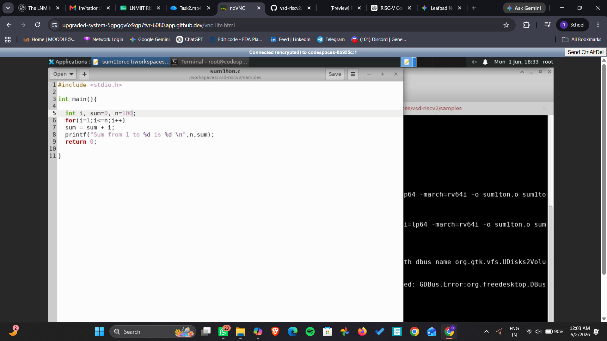
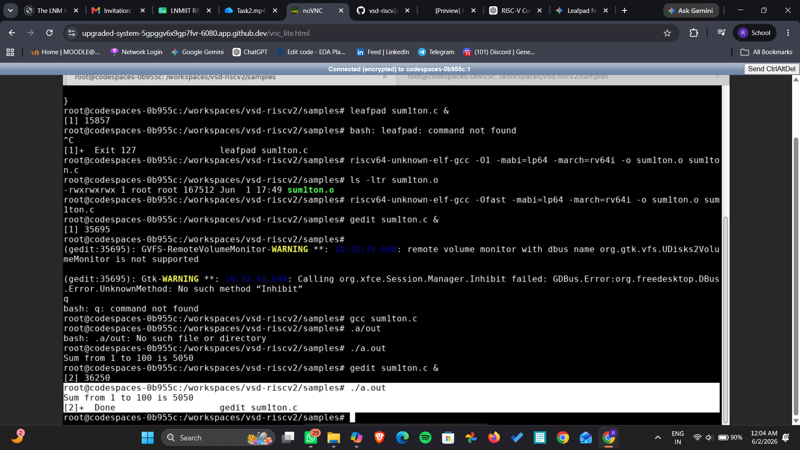
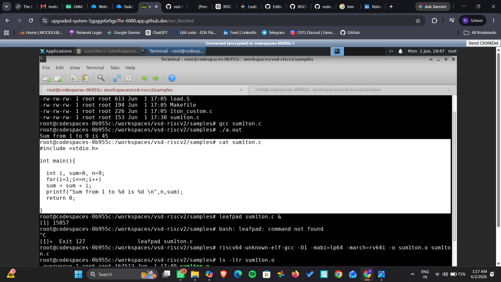
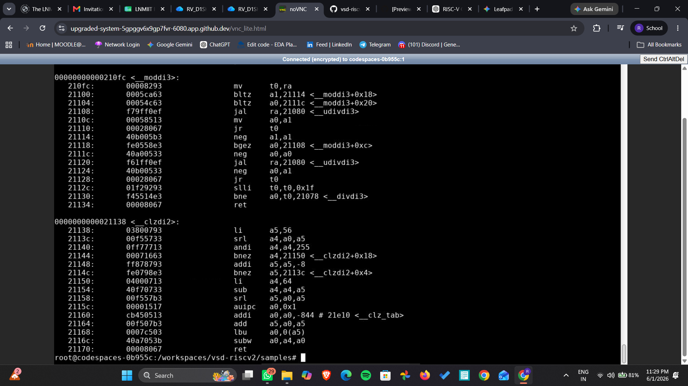
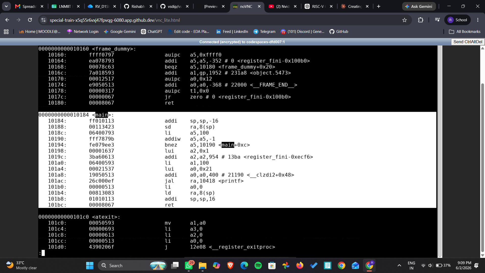
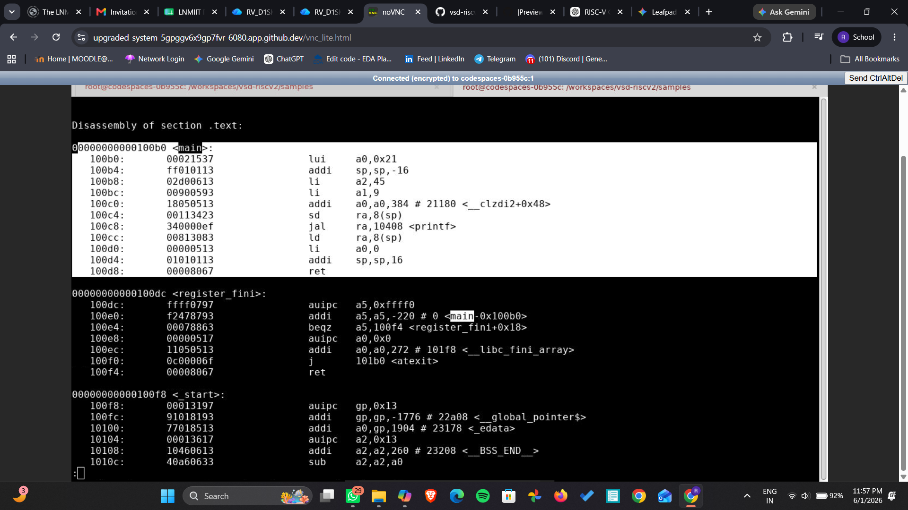
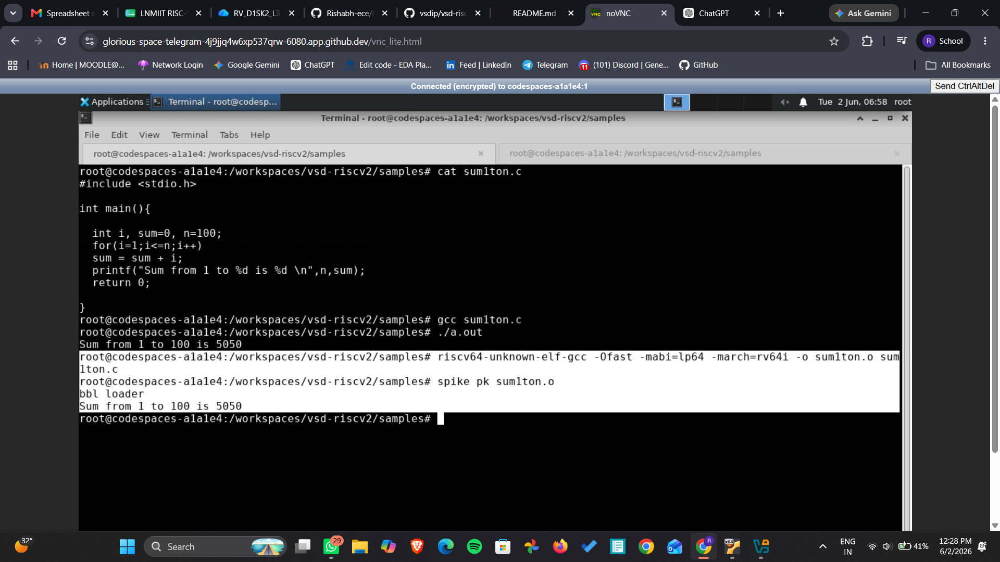
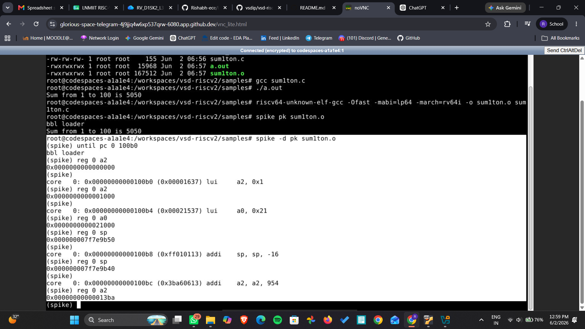

# RISC-V-Internship
##  Basic Details
**Name:** Rishabh Agarwal<br>
**College:** The LNM Institute of Information Technology <br>
**Email ID:** 24uec246@lnmiit.ac.in <br>
**GitHub Profile:** [Rishabh-ece](https://github.com/Rishabh-ece?tab=repositories)  <br>
**LinkedIN Profile:** [Rishabh Agarwal](https://www.linkedin.com/in/rishabh-agarwal-ece/) <br>


---

<details>
<summary><b>Task 1:</b> Compilation of C Program using GCC and RISC-V GCC Compiler</summary>
 <br>
 
This task demonstrates how to compile a simple C program using both the native GCC compiler and the RISC-V GCC compiler. The objective is to understand the compilation flow and observe the generated RISC-V assembly instructions.
 
---
 
# C Language Compilation using GCC
 
Follow the steps below to compile and execute a C program in the github cloud environment.
 
## Step 1: Create the C File
 
Open the terminal and navigate to your working directory. Create a new C source file using:
 
```bash
gedit sum_1ton.c
```
 
This command opens the text editor where the C program can be written.
 
---
 
## Step 2: Write the Program
 
Write a program to calculate the sum of numbers from 1 to n.
 

 
Save the file using:
 
```text
Ctrl + S
```
 
---
 
## Step 3: Compile and Execute using GCC
 
Run the following commands:
 
```bash
gcc sum_1ton.c
./a.out
```
 
The program output will be displayed on the terminal.
 

 
---
 
# RISC-V GCC Compilation
 
In this section, the same C program is compiled using the RISC-V cross compiler.
 
---
 
## Step 1: Display the C Program
 
Use the following command to display the program contents:
 
```bash
cat sum_1ton.c
```
 

 
---
 
## Step 2: Compile using RISC-V GCC Compiler
 
Execute the following command:
 
```bash
riscv64-unknown-elf-gcc -O1 -mabi=lp64 -march=rv64i -o sum_1ton.o sum_1ton.c
```
 
This command cross-compiles the C source file for the 64-bit RISC-V architecture using basic `-O1` optimization, generating an ELF object file (`sum_1ton.o`) that contains RISC-V machine instructions instead of native x86 instructions.
 
---
 
## Step 3: Generate Assembly Dump
 
Run the following command to disassemble the object file and inspect all sections:
 
```bash
riscv64-unknown-elf-objdump -d sum_1ton.o
```
 
`objdump -d` reverse-translates the compiled binary back into human-readable RISC-V assembly, allowing you to examine exactly which instructions the compiler generated for each function in your program.
 
The generated assembly output for the compiled program is shown below:
 

 
---
 
## Step 4: View Assembly in `less` and Search for `main`
 
To navigate the disassembly output more conveniently, pipe it into `less`:
 
```bash
riscv64-unknown-elf-objdump -d sum_1ton.o | less
```
 
Inside `less`, search for the `main` function by typing:
 
```text
/main
```
 
This jumps directly to the `main` section of the assembly.
 
### `-O1` Optimization — 15 Instructions in `main`
 
With `-O1` optimization, the compiler applies basic optimizations while keeping the code relatively readable. The `main` function contains **15 instructions**.
 

 
---
 
### `-Ofast` Optimization — 12 Instructions in `main`
 
Recompile using `-Ofast` for aggressive optimization:
 
```bash
riscv64-unknown-elf-gcc -Ofast -mabi=lp64 -march=rv64i -o sum_1ton.o sum_1ton.c
```
 
With `-Ofast`, the compiler applies maximum speed optimizations, reducing the instruction count in `main` to just **12 instructions** — fewer operations mean faster execution.
 

 
---
 
 
# Conclusion
 
Through this task, the compilation flow of a C program was explored using both the native GCC compiler and the RISC-V cross compiler. The generated RISC-V assembly instructions were analyzed using `objdump`, providing insight into how high-level C code is translated into machine-level instructions for RISC-V architecture. A clear difference was observed between `-O1` (15 instructions in `main`) and `-Ofast` (12 instructions in `main`), demonstrating how compiler optimizations directly impact the generated instruction count.
</details>

---
<details>
<summary> <b>Task 2:</b> SPIKE Simulation and Debugging using RISC-V GCC</summary>
<br>

This task demonstrates execution and debugging of a C program using the RISC-V simulator **SPIKE**.  
The objective of this task is to understand:

- RISC-V program execution
- Assembly generation using `-Ofast`
- Instruction-level debugging
- Register value tracing
- Stack pointer modification during execution

---

# Step 1: Navigate to Working Directory

Move into the RISC-V samples directory using the following commands:

```bash
cd /workspaces/vsd-riscv2/
cd samples
````

---

# Step 2: Compile the Program using RISC-V GCC

Compile the C program using aggressive optimization (`-Ofast`):

```bash
riscv64-unknown-elf-gcc -Ofast -mabi=lp64 -march=rv64i -o sum1ton.o sum1ton.c
```

### Description

* `-Ofast` enables high-level compiler optimizations for maximum execution speed.
* `-march=rv64i` targets the 64-bit RISC-V integer instruction set.
* `-mabi=lp64` specifies the 64-bit ABI.

---

# Step 3: Execute the Program using SPIKE

Run the compiled RISC-V object file using the SPIKE simulator:

```bash
spike pk sum1ton.o
```

### Description

* `spike` → RISC-V ISA simulator
* `pk` → Proxy kernel used to run programs on SPIKE
* `sum1ton.o` → Compiled RISC-V executable

The output of the program is shown below:



---

# Step 4: Observe Assembly Code of `<main>`

Generate the assembly dump using:

```bash
riscv64-unknown-elf-objdump -d sum1ton.o
```

The assembly generated using `-Ofast` optimization contains only **12 instructions** inside the `<main>` function.

This reduction in instruction count improves execution performance.


---

# Step 5: Open Debug Mode in SPIKE

To debug the program instruction-by-instruction, use:

```bash
spike -d pk sum1ton.o
```

The `-d` option opens the interactive debug window of SPIKE.

---

# Step 6: Move to the `<main>` Function

Inside the debug window, move execution directly to the address of `<main>`:

```bash
until pc 0 100b0
```

### Description

* `until` → Runs the program until a condition is met
* `pc` → Program Counter
* `100b0` → Address of the `<main>` function

---

# Step 7: Observe Register `a2`

Check the value stored inside register `a2` before execution:

```bash
reg 0 a2
```

After pressing **Enter**, the next instruction executes.

The first instruction executed is:

```assembly
lui a2,0x1
```

### What is `lui` Instruction?

`lui` stands for **Load Upper Immediate**.

It loads an immediate value into the upper 20 bits of the register.

Example:

```assembly
lui a2,0x1
```

stores:

```text
0x0000000000001000
```

inside register `a2`.

---

# Step 8: Observe Register `a0`

Similarly, inspect register `a0`:

```bash
reg 0 a0
```

After stepping through the next instruction:

```assembly
lui a0,0x21
```

the register value changes accordingly.

This demonstrates how immediate values are loaded into registers during execution.

---

# Step 9: Observe Stack Pointer Modification

The next important instruction is:

```assembly
addi sp,sp,-16
```

### What is `addi`?

`addi` stands for **Add Immediate**.

It adds an immediate constant value to a register.

Here:

```assembly
addi sp,sp,-16
```

reduces the stack pointer by 16 bytes to allocate stack space for the function.

---

## Observe Stack Pointer Before Instruction

```bash
reg 0 sp
```

---

## Observe Stack Pointer After Instruction Execution

Press **Enter** to execute the instruction and again check:

```bash
reg 0 sp
```

The value decreases by `16`, showing stack allocation.

---

# Complete SPIKE Debug Window

The complete debugging session showing:

* register inspection
* instruction execution
* stack pointer changes
* program counter movement

is shown below:



---

# Key Learnings

Through this task, the following concepts were explored:

* RISC-V program execution using SPIKE
* Assembly generation using `objdump`
* Impact of compiler optimization (`-Ofast`)
* Instruction-level debugging
* Register value inspection
* Stack pointer manipulation
* Understanding of `lui` and `addi` instructions

---

# Conclusion

This task provided hands-on experience with RISC-V simulation and debugging workflows using SPIKE. By stepping through instructions manually and observing register-level changes, a deeper understanding of low-level program execution and processor architecture was achieved.

```
```

</details>

---
