# RISC-V-Internship
## Basic Details
**Name:** Rishabh Agarwal<br>
**College:** The LNM Institute of Information Technology<br>
**Email ID:** 24uec246@lnmiit.ac.in<br>
**GitHub Profile:** [Rishabh-Github](https://github.com/Rishabh-ece?tab=repositories)<br>
**LinkedIn Profile:** [Rishabh-LinkedIn](https://www.linkedin.com/in/rishabh-agarwal-ece/)<br>

---

<details>
<summary><b>Task 1 :</b> Compilation of C Program using GCC and RISC-V GCC Compiler</summary>
<br>

This task demonstrates how to compile a simple C program using both the native GCC compiler and the RISC-V GCC compiler. The objective is to understand the compilation flow and observe the generated RISC-V assembly instructions.

---

# C Language Compilation using GCC

## Step 1: Navigate to Working Directory

```bash
cd /workspaces/vsd-riscv2/
cd samples
```

## Step 2: Create the C File

Open the terminal and navigate to your working directory. Create a new C source file using:

```bash
gedit sum_1ton.c
```

## Step 2: Write the Program

Write a program to calculate the sum of numbers from 1 to n.


Save the file using `Ctrl + S`.

## Step 3: Compile and Execute using GCC

```bash
gcc sum_1ton.c
./a.out
```


---

# RISC-V GCC Compilation

## Step 1: Display the C Program

```bash
cat sum_1ton.c
```


## Step 2: Compile using RISC-V GCC Compiler

```bash
riscv64-unknown-elf-gcc -O1 -mabi=lp64 -march=rv64i -o sum_1ton.o sum_1ton.c
```

This cross-compiles the C source for the 64-bit RISC-V architecture using `-O1` optimization, generating an ELF object file with RISC-V machine instructions.

## Step 3: Generate Assembly Dump

```bash
riscv64-unknown-elf-objdump -d sum_1ton.o
```

`objdump -d` reverse-translates the binary into human-readable RISC-V assembly.


## Step 4: View Assembly in `less` and Search for `main`

```bash
riscv64-unknown-elf-objdump -d sum_1ton.o | less
```

Inside `less`, type `/main` to jump directly to the `main` function.

### `-O1` Optimization — 15 Instructions in `main`

With `-O1`, the compiler applies basic optimizations. The `main` function contains **15 instructions**.


### `-Ofast` Optimization — 12 Instructions in `main`

```bash
riscv64-unknown-elf-gcc -Ofast -mabi=lp64 -march=rv64i -o sum_1ton.o sum_1ton.c
```

With `-Ofast`, the compiler applies aggressive optimizations, reducing `main` to just **12 instructions**.

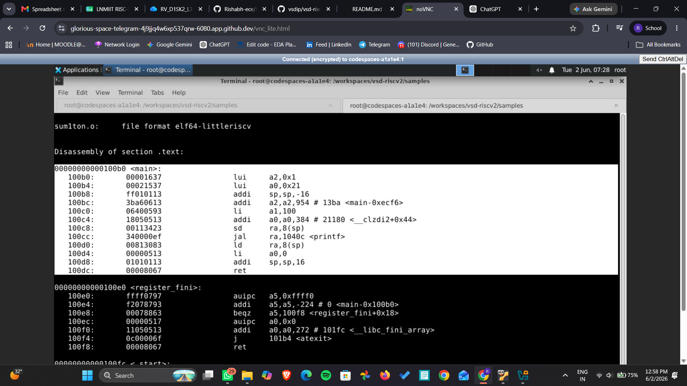

---

# `-O1` vs `-Ofast` — Key Differences

| Feature | `-O1` | `-Ofast` |
|---|---|---|
| **Optimization Level** | Basic | Aggressive / Maximum |
| **Instructions in `main`** | 15 | 12 |
| **Code Size** | Slightly reduced | Further reduced |
| **Standard Compliance** | Fully compliant | May relax IEEE/C standard |
| **Risk** | Very low | Edge-case math may differ |
| **Best Used For** | Development & debugging | Performance-critical builds |

---

# Conclusion

This task provided a hands-on understanding of the complete compilation pipeline — from writing a C program to analyzing its RISC-V assembly. By compiling with both GCC (native) and the RISC-V cross-compiler, we observed how high-level C code translates into architecture-specific instructions.

The comparison between `-O1` and `-Ofast` clearly illustrated the impact of compiler optimizations: `-O1` produced **15 instructions** in `main`, while `-Ofast` reduced this to **12 instructions**. This highlights a key trade-off in embedded systems — **correctness vs. performance** — and understanding it is essential for anyone working with RISC-V or low-level development.

</details>

---

<details>
<summary><b>Task 2.1 :</b> SPIKE Simulation and Debugging using RISC-V GCC</summary>
<br>

This task demonstrates execution and debugging of a RISC-V compiled C program using the **SPIKE** simulator. Both `-O1` and `-Ofast` optimization levels are explored and compared.

---

## Step 1: Navigate to Working Directory

```bash
cd /workspaces/vsd-riscv2/
cd samples
```

---

## Step 2: Compile and Run using GCC (Native)

```bash
gcc sum1ton.c
./a.out
```

Then compile using RISC-V GCC and simulate with SPIKE:

```bash
riscv64-unknown-elf-gcc -Ofast -mabi=lp64 -march=rv64i -o sum1ton.o sum1ton.c
spike pk sum1ton.o
```

Both produce the same output, confirming correctness of the RISC-V binary.


---

## Step 3: Assembly of `<main>` — `-Ofast` vs `-O1`

### `-Ofast` — 12 Instructions

```bash
riscv64-unknown-elf-gcc -Ofast -mabi=lp64 -march=rv64i -o sum1ton.o sum1ton.c
riscv64-unknown-elf-objdump -d sum1ton.o | less
```

Search `/main` to jump to the `<main>` function.


### `-O1` — 15 Instructions

```bash
riscv64-unknown-elf-gcc -O1 -mabi=lp64 -march=rv64i -o sum1ton.o sum1ton.c
riscv64-unknown-elf-objdump -d sum1ton.o | less
```


`-Ofast` reduces `main` from **15 → 12 instructions** by aggressively eliminating redundant operations.

---

## Step 4: Debugging with SPIKE (`-d` flag)

Open the interactive SPIKE debugger:

```bash
spike -d pk sum1ton.o
```

### Debugging `-Ofast` build

Navigate to `<main>` at address `100b0`:

```bash
until pc 0 100b0
```

| Command | Instruction | Register | Before | After |
|---|---|---|---|---|
| `reg 0 a2` | `lui a2, 0x1` | `a2` | `0x0000000000000000` | `0x0000000000001000` |
| `reg 0 a0` | `lui a0, 0x21` | `a0` | — | `0x0000000000021000` |
| `reg 0 sp` | `addi sp, sp, -16` | `sp` | `0x000000007f7e9b50` | `0x000000007f7e9b40` |


### Debugging `-O1` build

Navigate to `<main>` at address `10184`:

```bash
until pc 0 10184
```

| Command | Instruction | Register | Before | After |
|---|---|---|---|---|
| `reg 0 sp` | `addi sp, sp, -16` | `sp` | `0x000000007f7e9b50` | `0x000000007f7e9b40` |
| `reg 0 a2` | `li a2, 45` | `a2` | — | `0x000000000000002d` |
| `reg 0 a1` | `li a1, 9` | `a1` | — | `0x0000000000000009` |

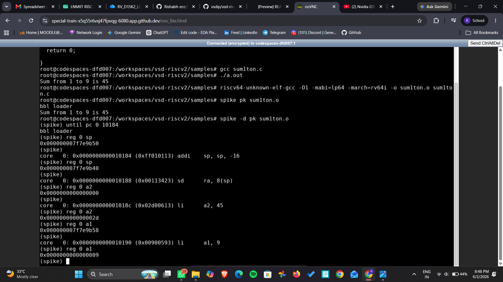

---

## Key Observations

- **`lui` (Load Upper Immediate):** Loads a value into the upper 20 bits of a register — used in `-Ofast` to build addresses/constants efficiently.
- **`li` (Load Immediate):** Loads a full immediate value directly into a register — more common in `-O1`.
- **`addi sp, sp, -16`:** Allocates 16 bytes of stack space at function entry — identical in both builds.
- Stack pointer changes identically in both: `0x7f7e9b50` → `0x7f7e9b40`.

---

## Conclusion

This task provided hands-on experience with RISC-V simulation and instruction-level debugging using SPIKE. By comparing `-O1` and `-Ofast`, it was observed that aggressive optimization reduces `main` from 15 to 12 instructions using more compact sequences (e.g., `lui` instead of `li`). Register tracing confirmed how values are loaded and how the stack pointer is managed at function entry — key concepts in understanding RISC-V calling conventions and processor execution flow.

</details>

---
<details>
  <summary><b>Task 2.2 :</b> Traffic Light Controller Simulation — RISC-V GCC & SPIKE</summary>
  <br>

---

## 📋 About the Project

This project simulates a **2-road Traffic Light Controller** using a **Finite State Machine (FSM)** in C. It cycles through 4 states representing real-world traffic light logic.

| State | Road A | Road B |
|-------|--------|--------|
| 0 | 🟢 Green | 🔴 Red |
| 1 | 🟡 Yellow | 🔴 Red |
| 2 | 🔴 Red | 🟢 Green |
| 3 | 🔴 Red | 🟡 Yellow |

---

## 🛠️ Step-by-Step Workflow

### Step 1 — Navigate to Working Directory

```bash
cd /workspaces/vsd-riscv2/
cd samples
```

---

### Step 2 — Write the C Program

The source code was written using **gedit** text editor inside the codespace environment.

```bash
gedit traffic_light.c
```

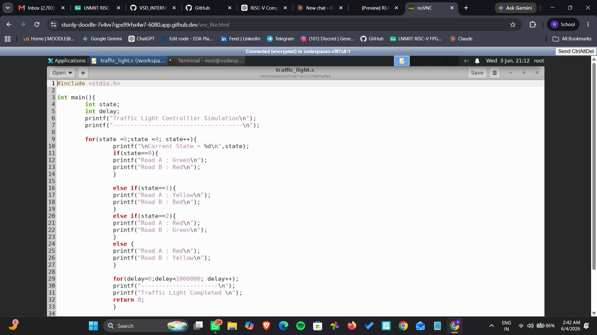

---

### Step 3 — Compile and Run with Native GCC

```bash
gcc traffic_light.c
./a.out
```

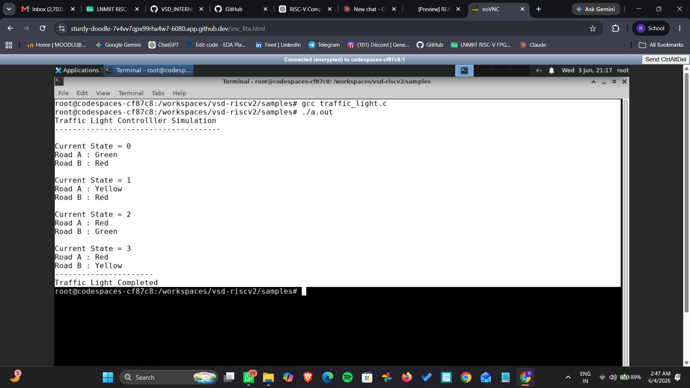

---

### Step 4 — Compile with RISC-V GCC (Create Object File)

The C code is cross-compiled for RISC-V architecture using the following command:

```bash
riscv64-unknown-elf-gcc -O1 -mabi=lp64 -march=rv64i -o traffic_light.o traffic_light.c
ls -ltr traffic_light.o
```

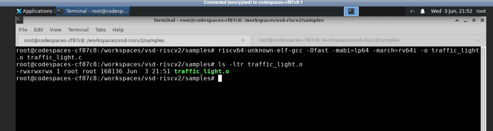

> The `ls -ltr` confirms the object file `traffic_light.o` was successfully created (168136 bytes).

---

### Step 5 — Run on SPIKE Simulator

```bash
spike pk traffic_light.o
```

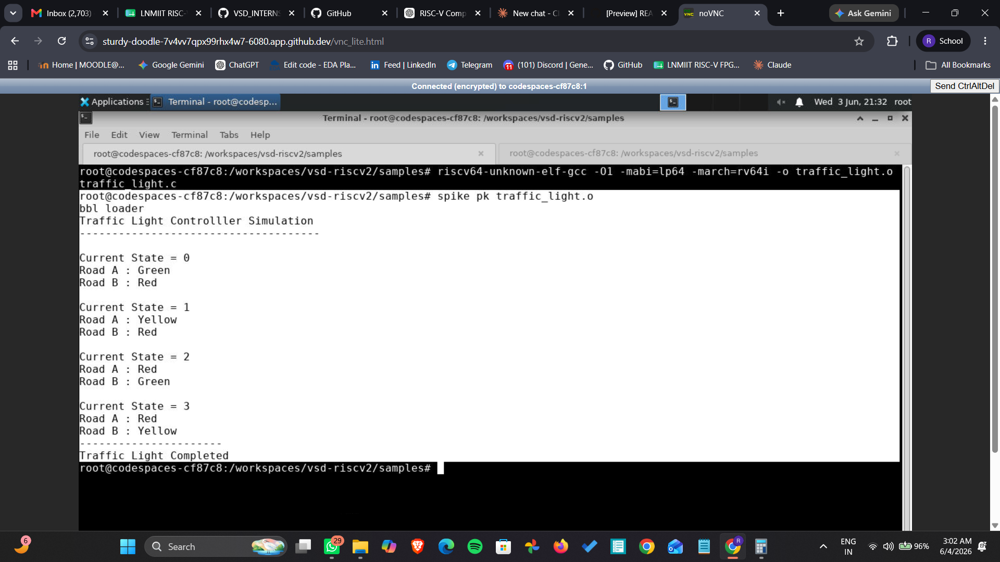

> Output is **identical** to native GCC — confirming the RISC-V binary works correctly on SPIKE.

---

### Step 6 — Objdump Analysis

Disassemble the binary to see the RISC-V assembly instructions:

```bash
riscv64-unknown-elf-objdump -d traffic_light.o | less
```

Search for main inside `less`:
```
/main
```

---

#### 🔷 Objdump with `-O1`

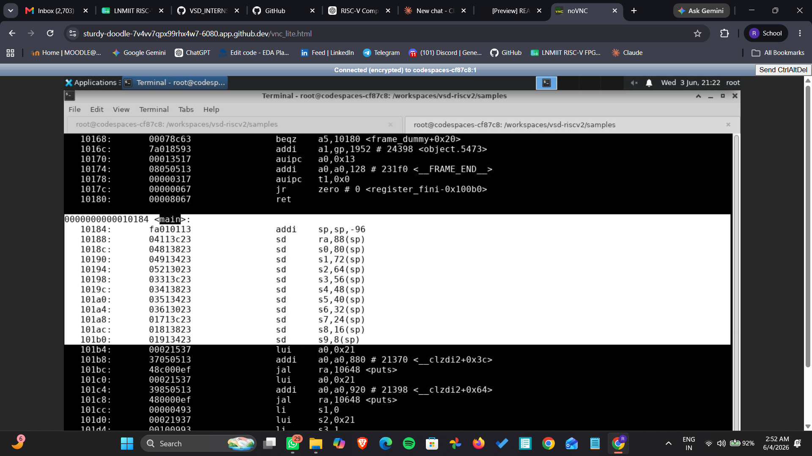

From the screenshot above, `main` starts at address **`0x10184`**.

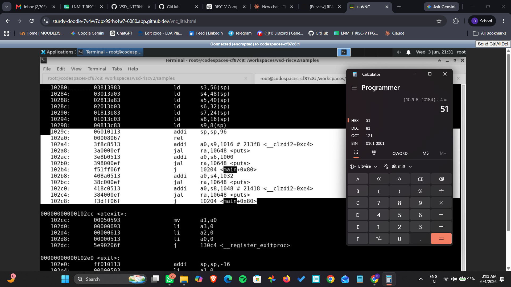

`main` ends at **`0x102C8`**. Using the calculator shown:

```
Number of Instructions = (End Address − Start Address) / 4
                       = (0x102C8 − 0x10184) / 4
                       = 0x144 / 4
                       = 324 / 4
                       = 81 instructions
```

> Each RISC-V instruction = **4 bytes**, so we divide the byte difference by 4.

---

#### 🔶 Objdump with `-Ofast`

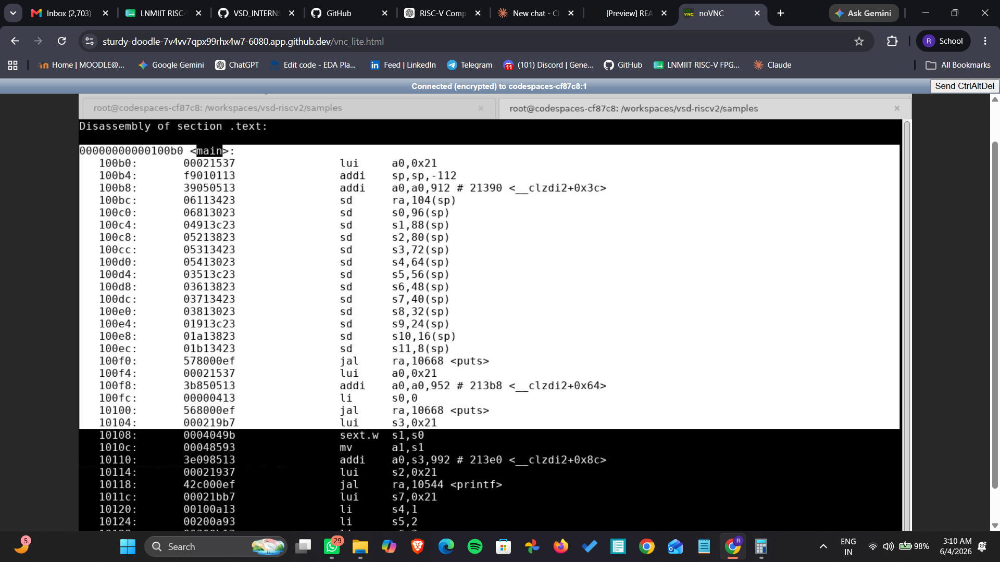

`main` starts at address **`0x100B0`**.

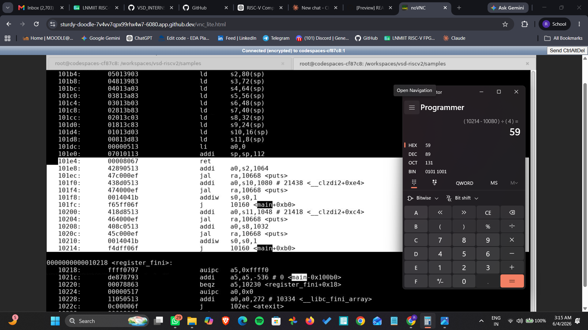

`main` ends at **`0x10214``. Using the calculator:

```
Number of Instructions = (0x10214 − 0x100B0) / 4
                       = 0x164 / 4
                       = 356 / 4
                       = 89 instructions
```

---

#### 📊 Comparison Table

| Flag | Start Address | End Address | Instructions |
|------|--------------|-------------|--------------|
| `-O1` | `0x10184` | `0x102C8` | **81** |
| `-Ofast` | `0x100B0` | `0x10214` | **89** |

---

#### ⚖️ Why does `-Ofast` have MORE instructions than `-O1`?

| Property | `-O1` | `-Ofast` |
|----------|-------|----------|
| Code size | Smaller (81 instr.) | Larger (89 instr.) |
| Execution speed | Moderate | Faster |
| Loop handling | Keeps original loop | May unroll loops |
| Stack allocated | 96 bytes | 112 bytes |

**Reason:** `-Ofast` applies aggressive techniques like **loop unrolling** (writes loop iterations explicitly instead of branching) and **function inlining** (prepares arguments inline instead of calling). This adds more instructions but eliminates branch penalties — so it runs faster even with more code.

> Analogy: `-O1` packs your bag normally. `-Ofast` unpacks and reorganizes everything for fastest access — uses more space but you grab things quicker.

---

### Step 7 — SPIKE Debug Mode

SPIKE's `-d` flag lets you step through every RISC-V instruction one by one — like watching your C code run at the hardware level.

```bash
spike -d pk traffic_light.o
```

---

#### 🔷 Debug with `-O1`

```bash
(spike) until pc 0 10184     # jump to start of main
(spike) reg 0 sp             # check stack pointer value
(spike)                      # press Enter to step instruction by instruction
```

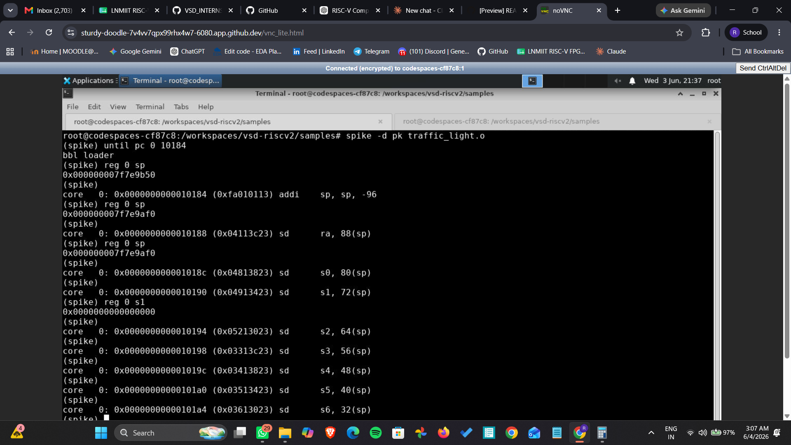

**Key instructions visible in `-O1` debug:**

| Instruction | What it does |
|-------------|-------------|
| `addi sp, sp, -96` | Allocates 96 bytes on stack for local variables |
| `sd ra, 88(sp)` | Saves return address — so main knows where to go back |
| `sd s0, 80(sp)` | Saves registers that will be used inside the function |
| `jal ra, <puts>` | Calls `puts`/`printf` to print the traffic light state |
| `addiw s0, s0, 1` | Increments loop counter (`state++`) |
| `j <main+0xb0>` | Jumps back to top of loop |

---

#### 🔶 Debug with `-Ofast`

```bash
(spike) until pc 0 100b0     # jump to start of main (-Ofast address)
(spike) reg 0 sp
(spike)
```

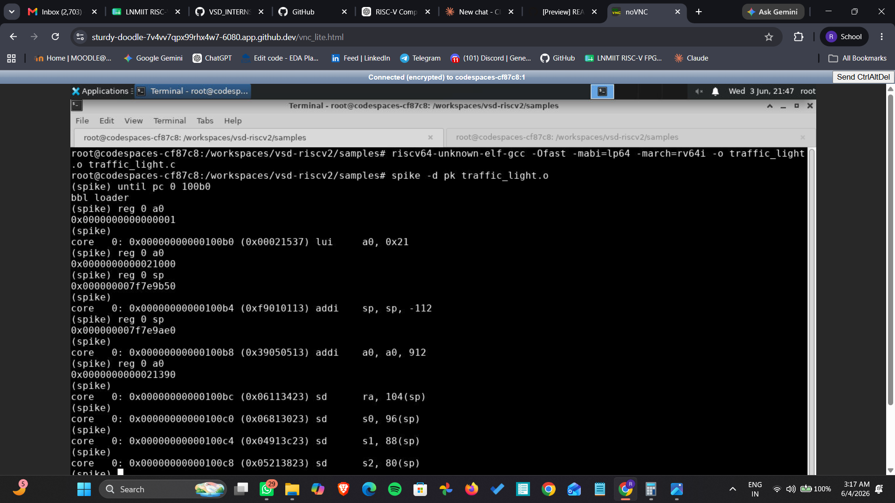

**Key differences in `-Ofast` debug:**

| Instruction | What it does |
|-------------|-------------|
| `lui a0, 0x21` | Loads string address **before** stack setup (aggressive reordering) |
| `addi sp, sp, -112` | Stack is **larger (112 bytes)** — more variables due to inlining |
| `addi a0, a0, 912` | Combines address calculation in fewer steps |
| `sd ra, 104(sp)` | Return address saved at higher offset (bigger stack frame) |

> Notice `-Ofast` starts by loading the string address (`lui`) even **before** allocating the stack — this is the compiler reordering instructions to keep the CPU pipeline busy.

---

#### 🔄 Side-by-Side Debug Difference

| | `-O1` | `-Ofast` |
|-|-------|----------|
| Main start address | `0x10184` | `0x100B0` |
| First instruction | `addi sp, sp, -96` | `lui a0, 0x21` |
| Stack size | 96 bytes | 112 bytes |
| Style | Conservative, readable | Aggressive, reordered |

---

## 🧰 Tools Used

| Tool | Purpose |
|------|---------|
| `gedit` | Writing C source code |
| `gcc` | Native x86 compilation and testing |
| `riscv64-unknown-elf-gcc` | Cross-compilation for RISC-V |
| `spike` | RISC-V ISA simulator |
| `pk` | Proxy kernel — minimal OS for SPIKE |
| `objdump` | Disassemble binary to RISC-V assembly |
| GitHub Codespaces | Cloud development environment |

---

## 📌 Key Learnings

1. Same C code → **different assembly** depending on the optimization flag.
2. `-Ofast` produces **more instructions** than `-O1` but runs **faster** due to loop unrolling and inlining.
3. Every RISC-V instruction = **4 bytes** → instruction count = address difference / 4.
4. The **function prologue** (`addi sp`, `sd ra`) and **epilogue** (`ld ra`, `ret`) are clearly visible in both objdump and debug.
5. `spike -d` is a powerful way to trace how C code maps to real hardware instructions.

---
</details>

----

<details>
<summary><b>Task 3 :</b> Environment Setup & RISC-V Reference Bring-Up</summary>
<br>
This task establishes the RISC-V + FPGA development environment and verifies the complete reference execution flow. It ensures the toolchain and simulation environment are properly configured before proceeding with FPGA and IP-level work.
 
 
---
 
## 🎯 Objective
 
Successfully configure the development environment and validate the RISC-V reference flow by compiling and executing sample programs, then clone and build the VSDFPGA labs firmware.
 
**This task focuses on:**
- Toolchain verification and readiness
- Understanding the RISC-V compilation and firmware flow
- Running the VSDFPGA labs in simulation (without FPGA hardware)
- Building a stable foundation for upcoming internship tasks
---
 
## 🖥️ Environment Used
 
| Environment | Purpose |
|---|---|
| GitHub Codespace (`sturdy-doodle`) | Primary development — Steps 1, 2, 3 |
| Oracle VirtualBox VM (Ubuntu) | Local setup verification — Step 4 |
 
---
 
## Step 1: Set Up GitHub Codespace
 
The official **vsd-riscv2** repository was forked from [https://github.com/vsdip/vsd-riscv2](https://github.com/vsdip/vsd-riscv2) to my GitHub account and a Codespace was launched directly from the fork.
 
The Codespace initialized and built successfully, providing a pre-configured Linux environment with all required RISC-V development tools already installed — including `riscv64-unknown-elf-gcc` and the Spike ISA simulator. No manual tool installation was needed.
 
**Repository forked:** `Rishabh-ece/vsd-riscv2` | **Codespace name:** `sturdy-doodle`
 
---
 
## Step 2: Verify RISC-V Reference Flow
 
### 2.1 — Confirm Toolchain Version
 
The RISC-V cross-compiler version was verified to confirm the toolchain is correctly installed.
 
```bash
riscv64-unknown-elf-gcc --version
```
 
The output confirmed **SiFive GCC 8.3.0-2019.08.0**, proving the compiler is ready.
 
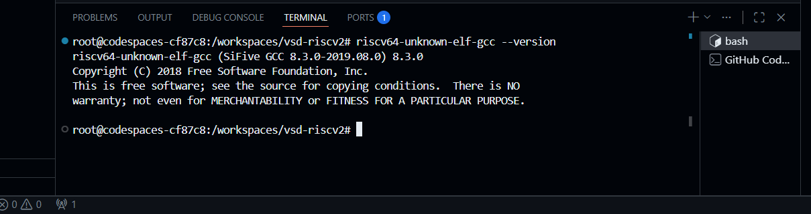
 
---
 
### 2.2 — Navigate to Samples Directory
 
```bash
cd /workspaces/vsd-riscv2
cd samples
ls -ltr
```
 
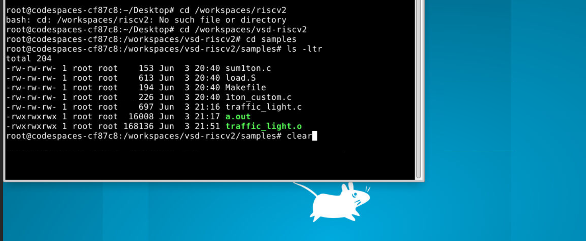
 
---
 
### 2.3 — Compile and Run the Reference Program
 
The `sum1ton.c` program was compiled and executed two ways — native GCC first, then via the RISC-V cross-compiler and Spike simulator — to verify the full toolchain end-to-end.
 
```bash
# Native GCC
gcc sum1ton.c
./a.out
 
# RISC-V cross-compilation + Spike simulation
riscv64-unknown-elf-gcc -o sum1ton.o sum1ton.c
spike pk sum1ton.o
```
 
Both produced identical output:
 
```
Sum from 1 to 9 is 45
```
 
This confirms the RISC-V binary is functionally correct and the toolchain is fully working.
 
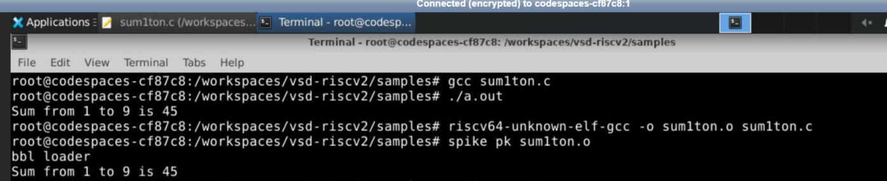
 
---
 
## Step 3: Clone and Run VSDFPGA Labs
 
### 3.1 — Clone the VSDFPGA Labs Repository
 
Once the RISC-V reference flow was verified, the VSDFPGA Labs repository was cloned into the Codespace.
 
```bash
git clone https://github.com/vsdip/vsdfpga_labs
cd vsdfpga_labs
```
 
 
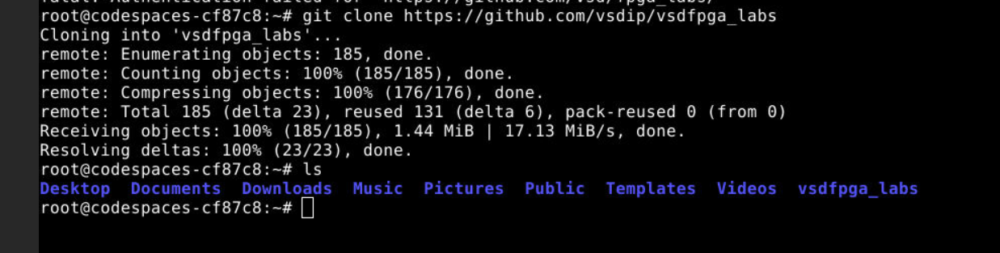
 
---
 
### 3.2 — Review the Firmware Source: `riscv_logo.c`
 
The firmware source was inspected using `cat` to understand the program's structure before building it.
 
```bash
cd ~/vsdfpga_labs/basicRISCV/Firmware
cat riscv_logo.c
```

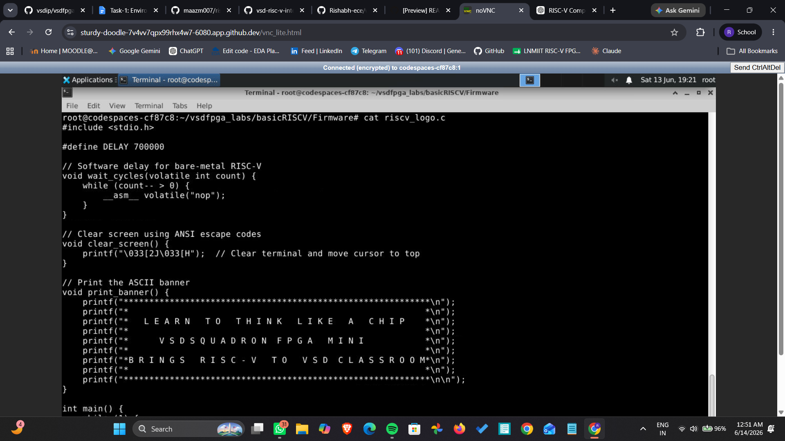
 
---
 
### 3.3 — Generate the BRAM Hex File
 
The firmware was compiled to produce `riscv_logo.bram.hex` — the memory initialization file embedded into the FPGA's Block RAM (BRAM).
 
```bash
make riscv_logo.bram.hex
```
 
The `make` command drives the full pipeline:
 
1. Cross-compiles `riscv_logo.c` → `riscv_logo.o` using `riscv64-unknown-elf-gcc`
2. Assembles support files: `start.S`, `putchar.S`, `wait.S`, `perf.S`
3. Links all objects using `bram.ld` → produces `riscv_logo.bram.elf`
4. Runs `firmware_words` to convert the ELF binary → `riscv_logo.bram.hex`
5. Copies the hex file into `../RTL/` for use in the FPGA build
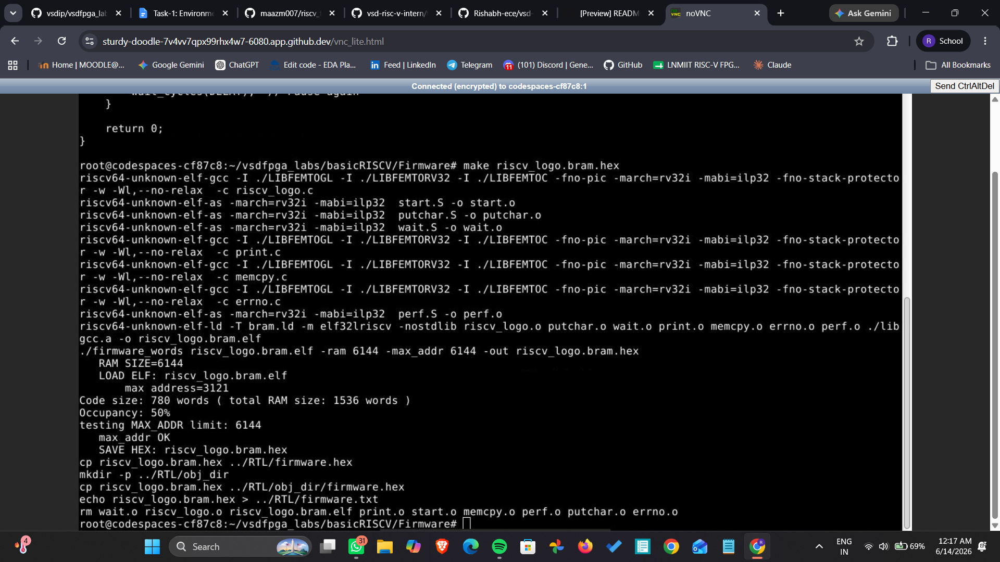
 
---
 
### 3.4 — BRAM Hex Generation Output
 
The build completed successfully with these key metrics:
 
```
RAM SIZE=6144
Code size: 780 words ( total RAM size: 1536 words )
Occupancy: 50%
SAVE HEX: riscv_logo.bram.hex
```
 
The firmware uses exactly **50% of the available BRAM**, leaving headroom for future additions. The hex file was automatically placed in `RTL/firmware.hex` and `RTL/obj_dir/firmware.hex`.
 
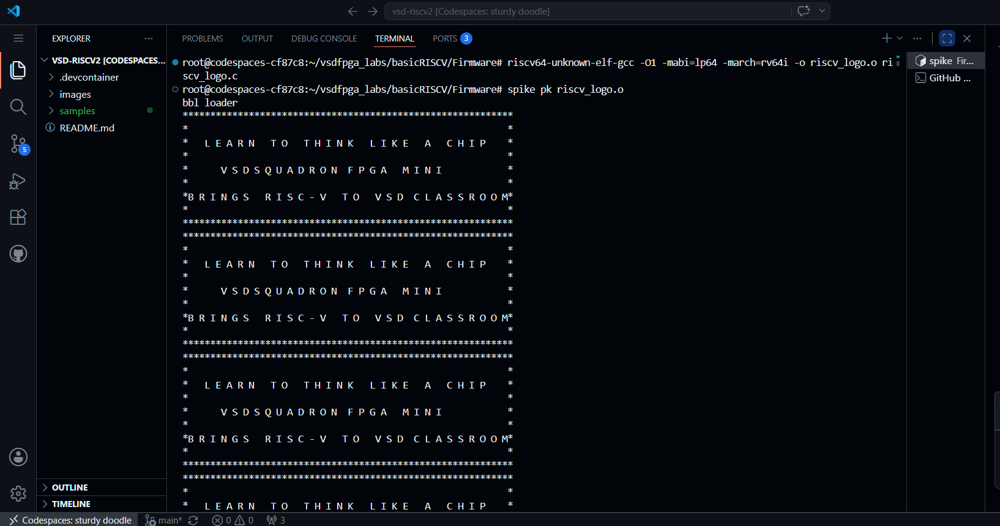
 
---
 
## Step 4: Local Machine Preparation (Oracle VirtualBox VM)
 
To prepare for future FPGA hardware tasks that require local execution, the development environment was replicated on an **Oracle VirtualBox VM** running Ubuntu. Both repositories were cloned locally, and the same build flow was verified.
 
```bash
ls ~
# vsdfpga_labs  vsd-riscv2  VSDSquadron_FM  vsd_ss  ...
```
 
The home directory listing confirms both `vsdfpga_labs` and `vsd-riscv2` are present on the local machine alongside other project directories.
 
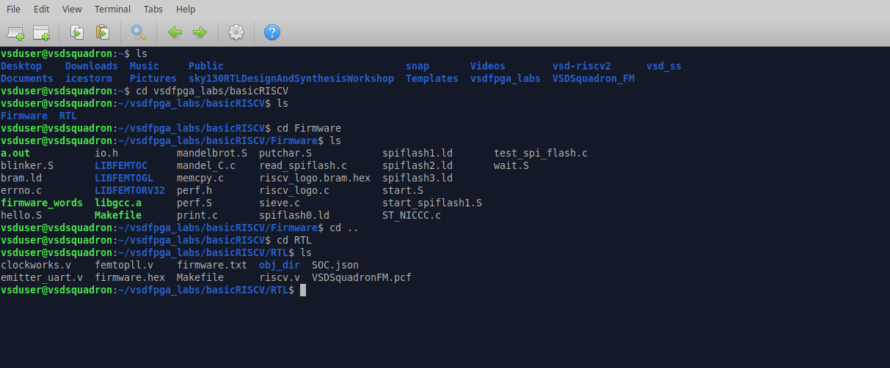
 
---
 
### 4.1 — Inspect Firmware Using Nano on VM
 
Inside the VM, `riscv_logo.c` was opened with `nano` to inspect the firmware and verify the local environment is functional.
 
```bash
cd ~/vsdfpga_labs/basicRISCV/Firmware
nano riscv_logo.c
```
 
The complete source was visible — `print_banner()`, delay loop, `clear_screen()`, and `main()` — confirming the file was cloned correctly.
 
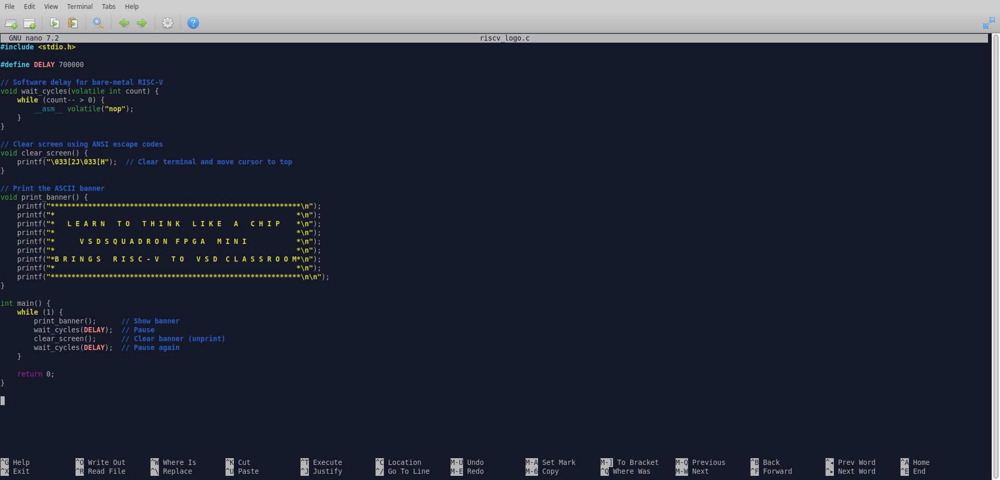
 
---
 
### 4.2 — Generate BRAM Hex Locally on VM
 
The firmware was also built locally to verify the VM toolchain works correctly, independent of the Codespace.
 
```bash
make riscv_logo.bram.hex
```
 
The local build succeeded with **51% BRAM occupancy**, confirming the local environment is fully operational for future tasks.
 
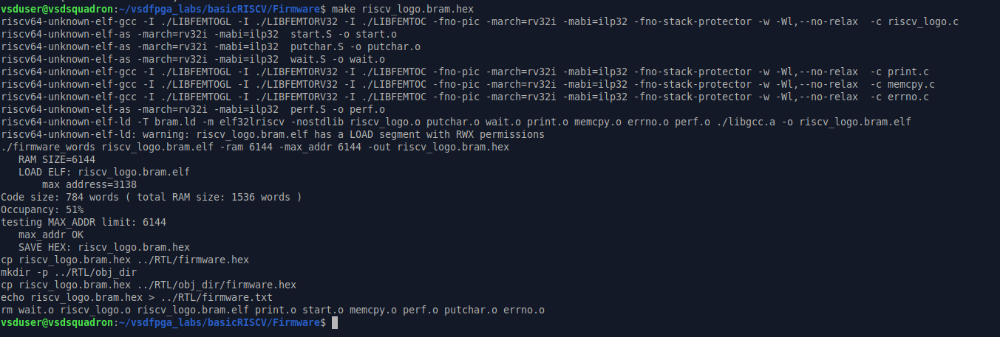

## 4.3 — Build the FPGA Design on the Local VM

After successfully generating `riscv_logo.bram.hex`, the FPGA RTL build flow was executed to verify that the local development environment was properly configured.

```bash
cd ~/vsdfpga_labs/basicRISCV/RTL

make clean
make build
```

* `make clean` removes previously generated synthesis and implementation files.
* `make build` starts the FPGA synthesis and place-and-route flow using **Yosys** and **nextpnr**.

The synthesis process started successfully and generated the expected build logs, confirming that the FPGA development tools were correctly installed and functioning.

After building the design, the following command was executed:

```bash
sudo make flash
```

This command is used to program the generated bitstream (`SOC.bin`) onto the FPGA board.

Since no FPGA board was connected during this task, the flashing step could not be completed successfully.

---

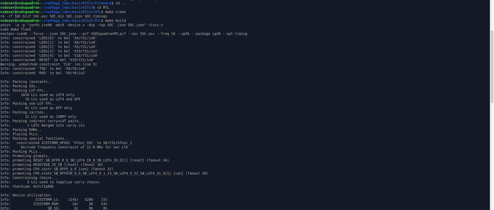

---


## 4.4 — Open the Serial Terminal

To communicate with the FPGA over UART, the following command was executed:

```bash
make terminal
```

This launches **picocom** and attempts to connect to the serial device `/dev/ttyUSB0`.

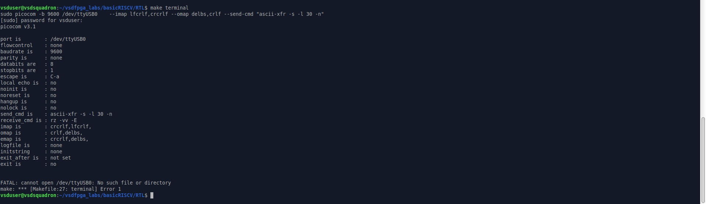

The command produced the following error:

```text
FATAL: cannot open /dev/ttyUSB0: No such file or directory
```

This happened because no physical FPGA board was connected to the Virtual Machine. The device `/dev/ttyUSB0` is created only when the FPGA board is attached through USB and recognized by the operating system.

Therefore, hardware-dependent operations such as serial communication could not be performed in the absence of the FPGA board.

---

### Note

The commands `make build`, `sudo make flash`, and `make terminal` are intended for FPGA hardware execution. While the synthesis flow could be started successfully, the flashing and terminal steps require a connected FPGA board and therefore could not be completed in this setup.

 
---
 
## 🧠 Understanding Check — Mandatory Questions
 
### Q1: Where is the RISC-V program located in the `vsd-riscv2` repository?
 
The RISC-V reference program is located in the **`samples/`** directory of the `vsd-riscv2` repository. The primary file is `sum1ton.c`, which calculates the sum of integers from 1 to N. Supporting files include `load.S` (assembly bootloader), `1ton_custom.c` (a variant), and a `Makefile` for build automation.
 
```
vsd-riscv2/
└── samples/
    ├── sum1ton.c       ← Main reference program
    ├── load.S          ← Assembly bootloader
    ├── 1ton_custom.c   ← Custom variant
    └── Makefile        ← Build script
```
 
---
 
### Q2: How is the program compiled and loaded into memory?
 
The process follows two steps:
 
**Step 1 — Cross-Compilation:**
```bash
riscv64-unknown-elf-gcc -o sum1ton.o sum1ton.c
```
The C source is compiled by the RISC-V cross-compiler into a RISC-V binary (ELF format). This binary contains RISC-V machine instructions and cannot run on a native x86 PC — it needs a RISC-V processor or simulator.
 
**Step 2 — Loading and Simulation via Spike + Proxy Kernel:**
```bash
spike pk sum1ton.o
```
- **Spike** is a software RISC-V CPU — it simulates the processor in its entirety.
- **pk (Proxy Kernel)** is a minimal OS shim that loads the binary into simulated memory, sets up the execution environment, and handles system calls like `printf`.
```
sum1ton.c
    │
    ▼  riscv64-unknown-elf-gcc
sum1ton.o  (RISC-V ELF binary)
    │
    ▼  spike + pk
Simulated RISC-V Memory
    │
    ▼
Execution → Output
```
 
---
 
### Q3: How does the RISC-V core access memory and memory-mapped I/O?
 
he RISC-V processor accesses both memory and hardware peripherals using normal load and store instructions.

In a memory-mapped I/O system, devices such as UART, GPIO, or timers are assigned specific memory addresses. When the processor reads from or writes to those addresses, it communicates with the hardware instead of normal RAM.

For example:

Reading or writing to RAM accesses program or data memory.
Writing to a UART address sends data to the serial port.

This allows the processor to control hardware using ordinary memory operations.
 
### Q4: Where would a new FPGA IP block logically integrate in this system?

A new FPGA IP block would be connected to the **system bus** as a **memory-mapped peripheral**. It would be assigned a unique memory address, allowing the RISC-V processor to communicate with it using normal load (`lw`) and store (`sw`) instructions.

For example, if a custom hardware module such as a traffic light controller or an AES encryption engine is mapped to address `0x30000000`, the processor can control it simply by reading from or writing to that address. No changes to the RISC-V core are required.

This modular approach makes it easy to add new hardware accelerators or peripherals to the system while keeping the processor architecture unchanged.

 
```
RISC-V Core
      │
   System Bus / MMIO
      │
 ┌────┼──────────────────────────────┐
 │    │                              │
 ▼    ▼         ▼          ▼        ▼
RAM  UART      GPIO       Timer   Custom FPGA IP ← New module
                                  (e.g., 0x30000000)
```
 
This modular, address-mapped architecture is standard in SoC design — hardware accelerators and peripherals can be added without touching the processor or bus arbitration logic.
 
---
 

## 📊 Results Summary
 
| Task | Status |
|---|---|
| GitHub Codespace launched from forked `vsd-riscv2` | ✅ Complete |
| RISC-V toolchain version confirmed | ✅ Complete |
| `sum1ton.c` compiled and run via native GCC | ✅ Complete |
| `sum1ton.c` compiled and run via Spike simulator | ✅ Complete |
| `vsdfpga_labs` repository cloned successfully | ✅ Complete |
| `riscv_logo.c` firmware reviewed and understood | ✅ Complete |
| BRAM hex file generated (`make riscv_logo.bram.hex`) | ✅ Complete |
| Local VM set up — both repos cloned and verified | ✅ Complete |
| `make clean` executed on local VM | ✅ Complete |
| `make build` synthesis flow started successfully | ✅ Complete |
| `sudo make flash` attempted | ⚠️ FPGA board not connected |
| `make terminal` attempted | ⚠️ `/dev/ttyUSB0` not available (no FPGA connected) |
| All four understanding check questions answered | ✅ Complete |
 
---
 
## 🧰 Tools Used
 
| Tool | Purpose |
|------|---------|
| GitHub Codespaces | Primary cloud development environment |
| Oracle VirtualBox (Ubuntu) | Local machine setup and verification |
| `riscv64-unknown-elf-gcc` | RISC-V cross-compilation |
| `spike` | RISC-V ISA simulator |
| `pk` | Proxy kernel — minimal OS for Spike |
| `make` | Build automation for firmware and FPGA flow |
| `nano` / `gedit` | Source file editing |
| `cat` | Reviewing source files in terminal |
 
---
 
## 📌 Key Learnings
 
1. A **GitHub Codespace** provides a fully pre-configured environment — no manual toolchain setup needed.
2. The RISC-V firmware compilation pipeline goes: `C source → cross-compile → ELF → firmware_words → BRAM hex → FPGA`.
3. **MMIO** is the standard way for RISC-V (and most embedded processors) to communicate with peripherals — no special I/O instructions needed.
4. New FPGA IP blocks integrate at the **bus level** with a unique address range — the processor core stays unchanged.
5. The full **edit → compile → run** cycle works identically in Codespace and on a local VM, confirming environment portability.
</details>

---
<details>
<summary><b>Task 4:</b> Design & Integrate a Simple GPIO Output IP (Memory-Mapped IP) </summary>
<br>

---

## 🎯 Objective

Design and integrate a **Simple GPIO Output IP** into the existing RISC-V SoC, then validate it using a real C program running on the simulated RISC-V CPU.

**IP Specification:** One 32-bit register — writing updates the output signal, reading returns the last written value.

---

## 🖥️ Environment

| Tool | Purpose |
|---|---|
| Oracle VirtualBox (Ubuntu) | Local development machine |
| `riscv64-unknown-elf-gcc` | RISC-V cross-compiler |
| `iverilog` + `vvp` | Verilog simulation |
| `gtkwave` | Waveform viewer |

**Working directories:**
- RTL: `~/vsdfpga_labs/basicRISCV/RTL/`
- Firmware: `~/vsdfpga_labs/basicRISCV/Firmware/`

---

## Step 1: Understand the Existing SoC

Before writing any code, `riscv.v` was studied to understand the bus structure, address decoding, and how existing peripherals are implemented.

### 1.1 — Locate `riscv.v`

```bash
cd vsdfpga_labs/basicRISCV/RTL
ls
gedit riscv.v
```

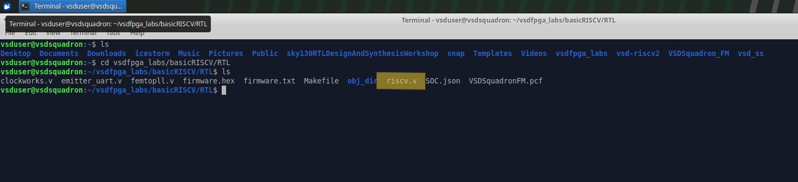

---

### 1.2 — Study the SOC Module: Bus Signals and Address Decoding

The `SOC` module (line 313) connects the CPU to all peripherals through a shared bus. Every peripheral — LEDs, UART, and your new GPIO IP — uses the same bus wires: `mem_addr`, `mem_wdata`, `mem_wmask`, `mem_rdata`, and `mem_wstrb`.

**How the SoC decides which peripheral to talk to:**

```verilog
wire isIO  = mem_addr[22];   // bit 22 = 1 → IO space (peripherals)
wire isRAM = !isIO;          // bit 22 = 0 → RAM

// Each peripheral gets its own bit number (1-hot addressing):
localparam IO_LEDS_bit      = 0;
localparam IO_UART_DAT_bit  = 1;
localparam IO_UART_CNTL_bit = 2;
// Your GPIO IP will use bit 3
```

So `mem_wordaddr[0]` high = LEDs selected. `mem_wordaddr[1]` = UART. GPIO gets **bit 3**.

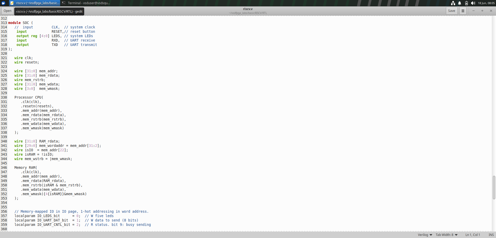

---

### 1.3 — How Peripherals Work: Write + Read + Simulation Output

**Write path** — same 3-condition pattern for every peripheral:
```verilog
always @(posedge clk) begin
    if(isIO & mem_wstrb & mem_wordaddr[IO_LEDS_bit])
        LEDS <= mem_wdata;   // update register when addressed + written
end
```

**Read path** — a mux routes the right peripheral's data back to the CPU:
```verilog
wire [31:0] IO_rdata =
    mem_wordaddr[IO_UART_CNTL_bit] ? {22'b0, !uart_ready, 9'b0} : 32'b0;
assign mem_rdata = isRAM ? RAM_rdata : IO_rdata;
```

**`` `ifdef BENCH `` block** — this makes `printf()` appear in the simulation terminal (no hardware needed):
```verilog
`ifdef BENCH
  always @(posedge clk) begin
    if(uart_valid) $write("%c", mem_wdata[7:0]);
  end
`endif
```

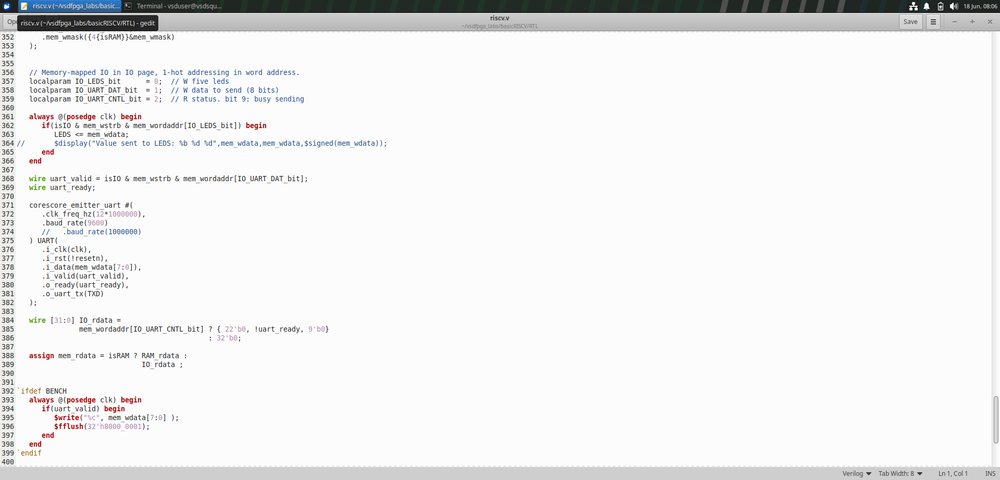

---

## Step 2: Write the GPIO IP RTL

A new file `gpio_ip.v` was created — a standalone Verilog module implementing the GPIO register.

```bash
gedit gpio_ip.v
```

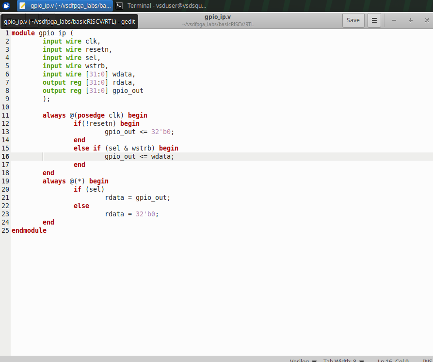

**Write logic — synchronous:**
```verilog
always @(posedge clk) begin
    if (!resetn)          gpio_out <= 32'b0;  // clear on reset
    else if (sel & wstrb) gpio_out <= wdata;  // store CPU's value on write
end
```

**Readback logic — combinational:**
```verilog
always @(*) begin
    if (sel)  rdata = gpio_out;  // return stored value when selected
    else      rdata = 32'b0;
end
```

> One register, write it, read it back — correctness first, no optimizations. This is the exact pattern every real hardware IP starts with.

---

## Step 3: Integrate the GPIO IP into the SoC

Three targeted edits were made to `riscv.v`.

### 3.1 — Add the GPIO Address Bit

```verilog
localparam IO_GPIO_bit = 3;  // new GPIO Output IP
```

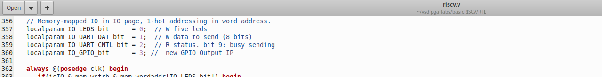

---

### 3.2 — Declare GPIO Wires

```verilog
wire        gpio_sel   = isIO & mem_wordaddr[IO_GPIO_bit];
wire        gpio_wstrb = mem_wstrb;
wire [31:0] gpio_rdata;
wire [31:0] gpio_out;
```

`gpio_sel` goes high only when the CPU addresses IO bit 3 — your IP's exclusive slot.

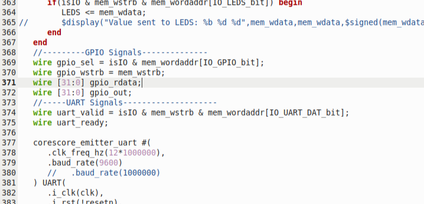

---

### 3.3 — Instantiate IP and Update Readback Mux

```verilog
gpio_ip GPIO (
    .clk(clk), .resetn(resetn), .sel(gpio_sel),
    .wstrb(gpio_wstrb), .wdata(mem_wdata),
    .rdata(gpio_rdata), .gpio_out(gpio_out)
);

wire [31:0] IO_rdata =
    (isIO && mem_wordaddr[IO_UART_CNTL_bit]) ? {22'b0, !uart_ready, 9'b0} :
    (isIO && mem_wordaddr[IO_GPIO_bit])      ? gpio_rdata :
                                               32'b0;
```

The `IO_rdata` mux update is critical — without it, reads always return `0`.

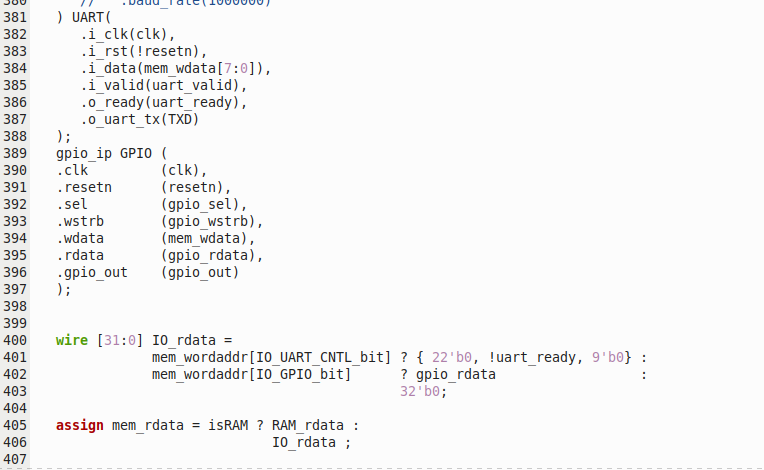

---

## Step 4: Validate Using Simulation

### 4.1 — GPIO Address Calculation

```bash
cat io.h
```

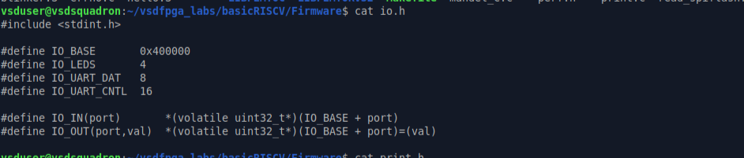

The existing pattern: `byte_offset = (1 << bit_number) << 2`

For GPIO (bit 3): `(1 << 3) << 2 = 32` → **GPIO address = `0x400000 + 32 = 0x400020`**

In code: `#define IO_GPIO 32`

---

### 4.2 — Write the C Test Program

```bash
gedit gpio_test.c
```

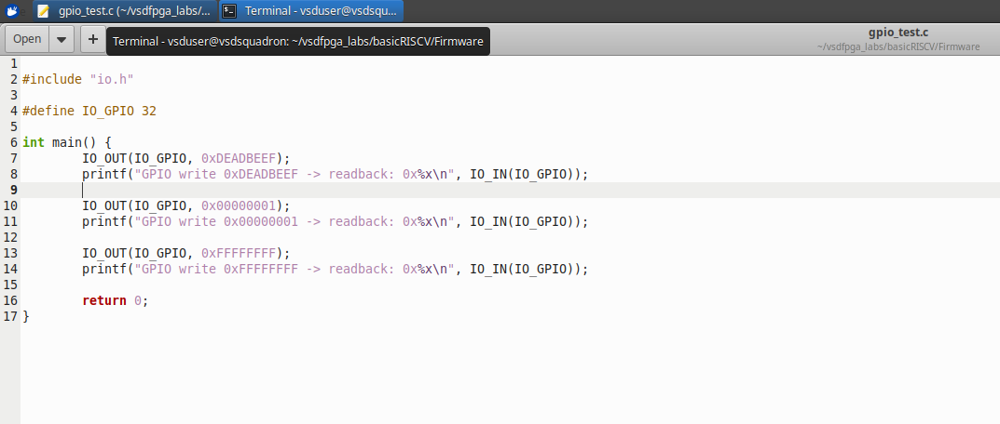

Writes three test values to the GPIO register via `IO_OUT` and reads them back via `IO_IN`, printing results through UART `printf`.

---

### 4.3 — Compile the Firmware

```bash
cd ~/vsdfpga_labs/basicRISCV/Firmware
make gpio_test.bram.hex
```

The Firmware Makefile handles the full RISC-V bare-metal pipeline: compile → assemble → link → convert to hex → copy to `../RTL/firmware.hex`.

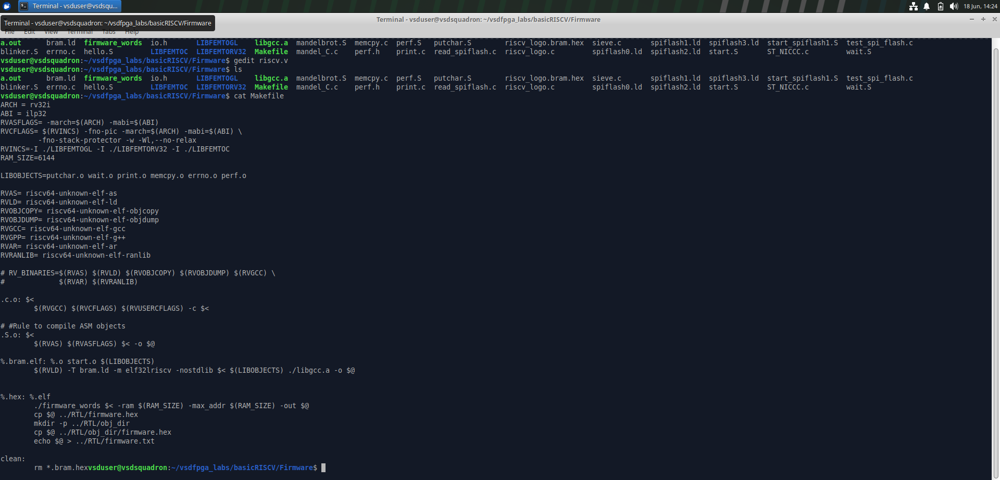

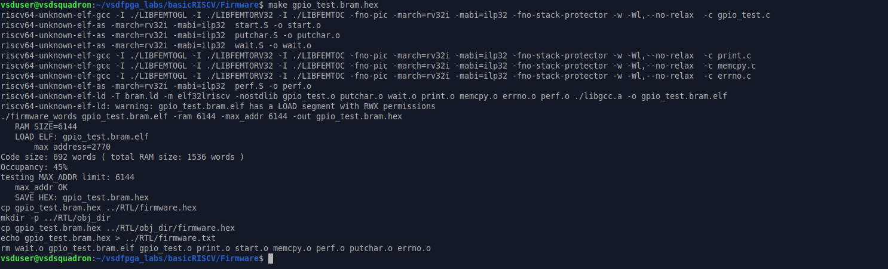

`riscv.v` loads this hex file into BRAM at simulation start via `$readmemh("firmware.hex", MEM)`:

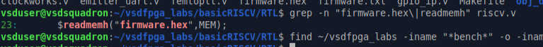

---

### 4.4 — The Simulation Testbench (`bench.v`)

`riscv.v` uses two iCE40 hardware primitives that `iverilog` cannot simulate — `SB_HFOSC` (oscillator) and `SB_PLL40_CORE` (PLL). These need to be replaced with simple stub models.

The clock chain was confirmed first:

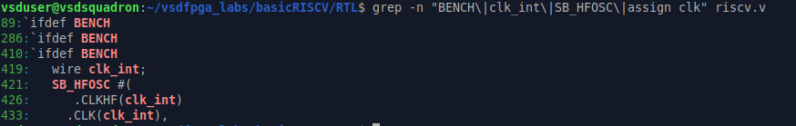

`SB_HFOSC` generates `clk_int` → `Clockworks` divides it → produces `clk` and `resetn` used everywhere.

`bench.v` contains three parts:

```bash
cat bench.v
```

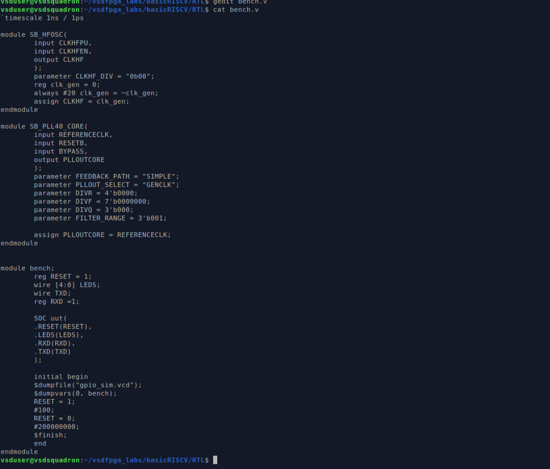

- **`SB_HFOSC` stub** — a register that toggles every 20ns, pretending to be the oscillator
- **`SB_PLL40_CORE` stub** — passes the clock straight through, pretending to be the PLL
- **`bench` module** — instantiates the full `SOC`, releases `RESET` after 100ns, runs for 200ms of simulation time, dumps signals to `gpio_sim.vcd` for GTKWave

---

### 4.5 — Run the Simulation

```bash
iverilog -g2012 -DBENCH -o gpio_sim riscv.v bench.v
vvp gpio_sim
```

(`gpio_ip.v` doesn't need to be listed separately — `riscv.v` already includes it internally via `` `include ``.)

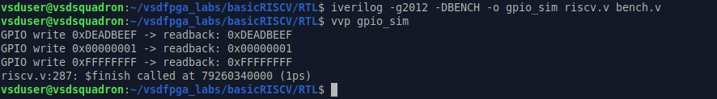

```
GPIO write 0xDEADBEEF -> readback: 0xDEADBEEF
GPIO write 0x00000001 -> readback: 0x00000001
GPIO write 0xFFFFFFFF -> readback: 0xFFFFFFFF
$finish called at 79260340000 (1ps)
```

---

### 4.6 — GTKWave Waveform

```bash
gtkwave gpio_sim.vcd
```

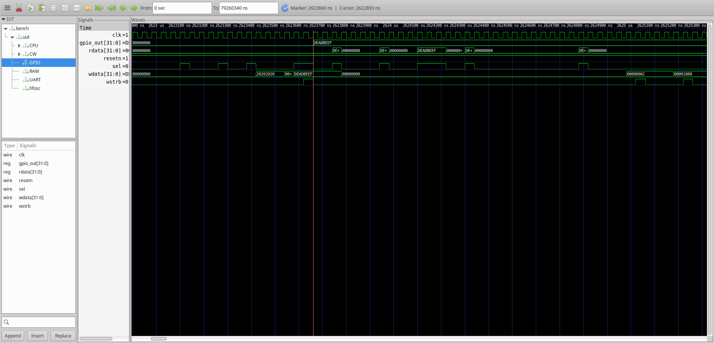

| Signal | What it shows | Proof |
|---|---|---|
| `clk` | Continuously toggling | ✅ Clock running |
| `resetn` | 0 → 1 transition | ✅ CPU starts executing |
| `sel` | Pulses at each GPIO access | ✅ Address decoding correct |
| `wstrb` | Pulses during writes | ✅ Write path active |
| `wdata[31:0]` | Shows `DEADBEEF` | ✅ Correct value from CPU |
| `gpio_out[31:0]` | Updates to `DEADBEEF` | ✅ Register stores value |
| `rdata[31:0]` | Reflects `DEADBEEF` | ✅ Readback correct |

---

## 📋 Submission Answers

### Address Used
**`0x400020`** — `IO_BASE (0x400000)` + offset `32 (0x20)`

Offset = `(1 << IO_GPIO_bit) << 2 = (1 << 3) << 2 = 32`

### How the CPU Accesses the IP

```
CPU writes to 0x400020
  → mem_addr[22]=1       → isIO=1
  → mem_wordaddr[3]=1    → gpio_sel=1 (GPIO IP selected)
  → gpio_ip stores wdata in gpio_out on next clock edge

CPU reads from 0x400020
  → gpio_sel=1           → gpio_rdata = gpio_out
  → IO_rdata mux selects gpio_rdata
  → CPU receives the stored value
```

### What Was Validated

- ✅ `0xDEADBEEF` written → read back correctly
- ✅ `0x00000001` written → read back correctly
- ✅ `0xFFFFFFFF` written → read back correctly
- ✅ `sel` pulses in waveform — address decoder working
- ✅ `gpio_out` updates after write — register logic working
- ✅ Program completed normally — no hangs or errors

---

## 📊 Results Summary

| Step | Status |
|---|---|
| Step 1: Understand SoC — bus, address decoding, peripherals | ✅ Done |
| Step 2: Write `gpio_ip.v` — register, write logic, readback | ✅ Done |
| Step 3: Integrate into `riscv.v` | ✅ Done |
| Step 4: Simulate with C test program — correct readback via UART | ✅ Done |
| Step 4: GTKWave waveform | ✅ Done |
| Step 5: Hardware validation (FPGA board) | ⚠️ Skipped — board not available |

---

## 📁 Files Created / Modified

| File | Location | Change |
|---|---|---|
| `gpio_ip.v` | `RTL/` | **New** — GPIO IP RTL module |
| `riscv.v` | `RTL/` | Modified — `IO_GPIO_bit`, wires, instantiation, mux |
| `gpio_test.c` | `Firmware/` | **New** — C test program |
| `bench.v` | `RTL/` | **New** — testbench with hardware primitive stubs |

---

</details>

----

<details>
<summary><b>Task 5:</b> Design a Multi-Register GPIO IP with Software Control (Direction + Data + Readback)</summary>
<br>

---

## 🎯 Objective

Extend the simple single-register GPIO IP from Task-4 into a **realistic, multi-register, software-controlled peripheral** — the kind that exists in every production SoC.

This task focuses on:
- Designing a proper **register map** with address offset decoding
- Handling **multiple registers** inside one IP module
- Deepening understanding of **memory-mapped I/O**
- Validating end-to-end control: **software → register → signal**

**IP Name:** GPIO Control IP (Direction + Data + Readback)

---

## 🗺️ Register Map

| Offset | Register Name | Description |
|--------|--------------|-------------|
| `0x00` | `GPIO_DATA`  | GPIO output data register — write updates output, read returns last written value |
| `0x04` | `GPIO_DIR`   | Direction register — `1` = output enabled, `0` = input mode |
| `0x08` | `GPIO_READ`  | Readback register — returns `GPIO_DATA & GPIO_DIR` (active output pins only) |

**Base Address:** `0x400020` (same as Task-4, `IO_BASE 0x400000` + offset `32`)

**Address offsets are carried by `mem_addr[3:2]`** → this 2-bit field selects which register inside the IP is being accessed.

---

## 🖥️ Environment

| Tool | Purpose |
|------|---------|
| Oracle VirtualBox (Ubuntu) | Local development machine |
| `gedit` | RTL and firmware editing |
| `riscv64-unknown-elf-gcc` | RISC-V cross-compiler |
| `iverilog` + `vvp` | Verilog simulation |
| `gtkwave` | Waveform viewer |
| EDA Playground | Quick RTL verification before VM integration |

**Working directories:**
- RTL: `~/vsdfpga_labs/basicRISCV/RTL/`
- Firmware: `~/vsdfpga_labs/basicRISCV/Firmware/`

---

## Step 1: Study the Existing GPIO IP (Task-4)

Before writing any new code, the Task-4 `gpio_ip.v` was reviewed to understand what needs to be extended.

```bash
cd ~/vsdfpga_labs/basicRISCV/RTL
ls
cat gpio_ip.v
```

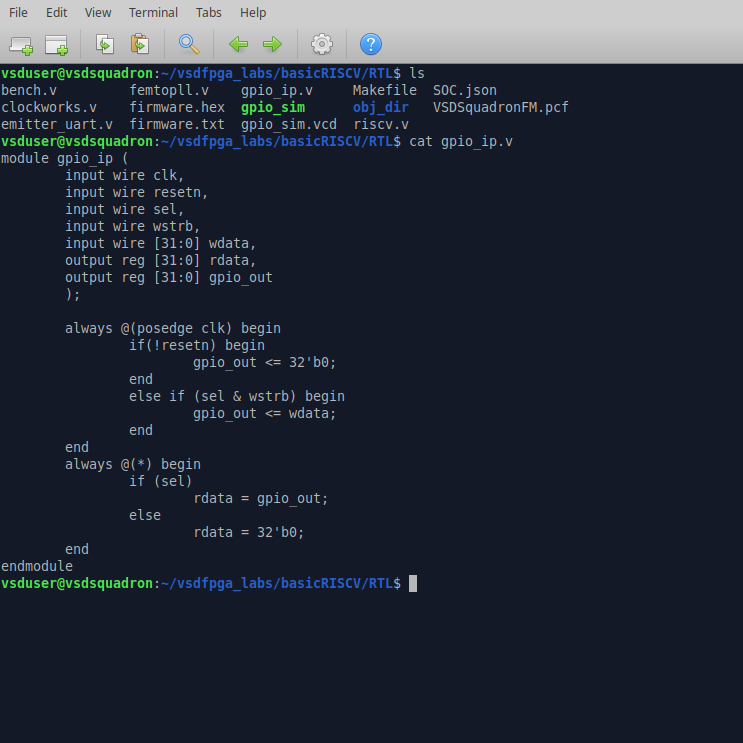

**What Task-4 had:**
- One 32-bit register (`gpio_out`)
- Single write path: `sel & wstrb` → update register
- Single read path: `sel` → return `gpio_out`
- No concept of register selection — every access hits the same register

**What needs to change for Task-5:**
- Add **3 registers**: `gpio_data`, `gpio_dir`, `gpio_read`
- Add **`offset[1:0]` input** to select which register is being accessed
- Add **address offset decoding** in both write and read paths
- `gpio_read` is **read-only** (combinational: `gpio_data & gpio_dir`)

---

## Step 2: Implement Multi-Register RTL

### 2.1 — Write the New `gpio_ip.v`

The GPIO IP was extended with a new port (`offset[1:0]`), two writable registers (`gpio_data`, `gpio_dir`), and a combinational readback register (`gpio_read`).

```bash
gedit gpio_ip.v
```

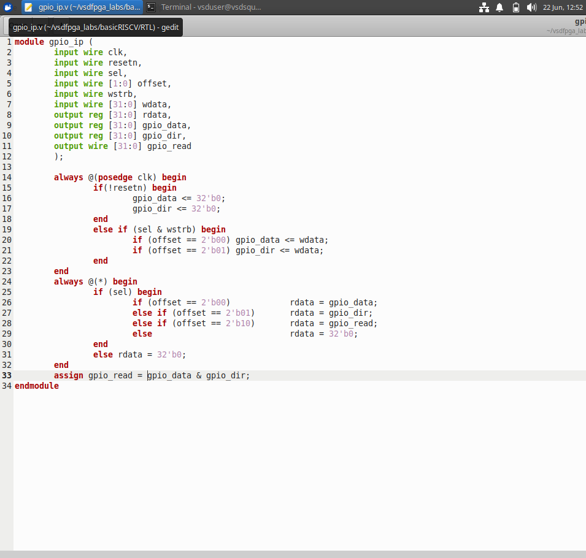


**Key design decisions:**
- `offset == 2'b00` → `GPIO_DATA` (byte offset `0x00`)
- `offset == 2'b01` → `GPIO_DIR` (byte offset `0x04`, word offset `0x01`)
- `offset == 2'b10` → `GPIO_READ` (byte offset `0x08`, word offset `0x02`)
- `GPIO_READ` write is silently ignored — no `else` branch in the write block
- `gpio_read` is a `wire` (not a `reg`) — it's purely combinational

---

### 2.2 — Verify on EDA Playground (Before VM Integration)

The new RTL was verified on **EDA Playground** using a testbench with 5 targeted tests before touching the actual SoC.

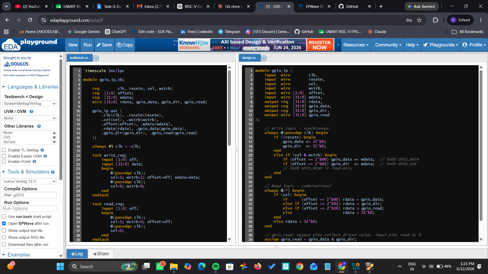

**Tests run:**
1. Write `0xFFFFFFFF` to `GPIO_DIR` → readback `GPIO_DIR`
2. Write `0xDEADBEEF` to `GPIO_DATA` → readback `GPIO_DATA`
3. Read `GPIO_READ` → expect `0xDEADBEEF` (all bits output-enabled)
4. Write `0x000000FF` to `GPIO_DIR` (partial) → readback `GPIO_DIR`
5. Read `GPIO_READ` → expect `0x000000EF` (`DEADBEEF & 000000FF`)

**EDA Playground EPWave waveform:**

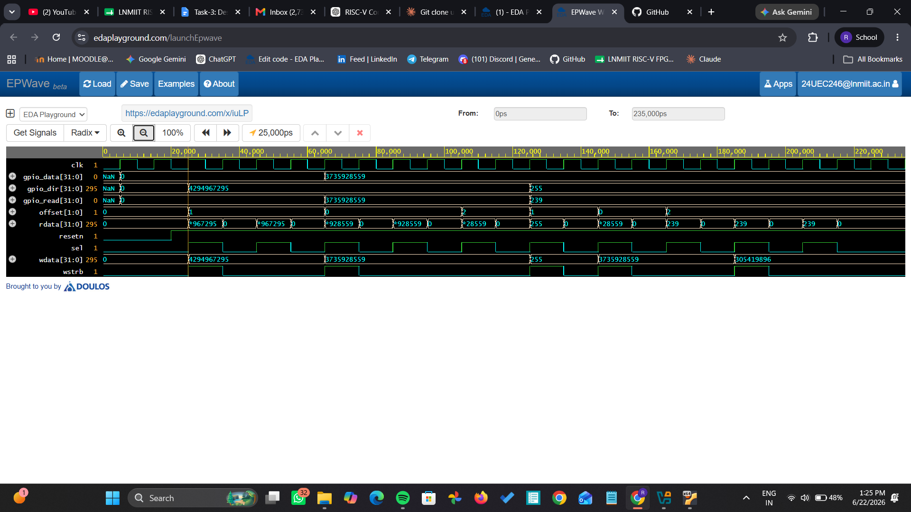

All 5 tests passed. The `gpio_read` signal correctly masks `gpio_data` with `gpio_dir` at each step.

---

## Step 3: Integrate the Updated IP into the SoC

Two targeted edits were made to `riscv.v`.

### 3.1 — Declare GPIO Wires (Updated for New Ports)

```verilog
//---------GPIO Signals---------------
wire        gpio_sel    = isIO & mem_wordaddr[IO_GPIO_bit];
wire        gpio_wstrb  = mem_wstrb;
wire [1:0]  gpio_offset = mem_addr[3:2];   // ← NEW: carries register offset
wire [31:0] gpio_rdata;
wire [31:0] gpio_data;
wire [31:0] gpio_dir;
wire [31:0] gpio_read;
```

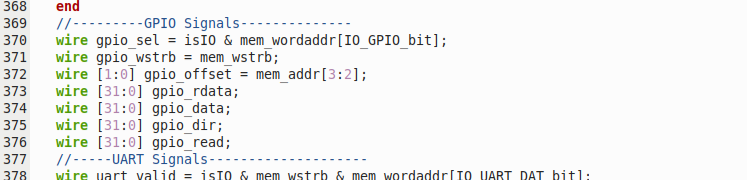

`mem_addr[3:2]` is a 2-bit field that sits above the word-align bits. When the CPU accesses `0x400020` (offset 0), it becomes `2'b00`; `0x400024` becomes `2'b01`; `0x400028` becomes `2'b10`.

---

### 3.2 — Update Instantiation with New Ports

```verilog
gpio_ip GPIO (
    .clk      (clk),
    .resetn   (resetn),
    .sel      (gpio_sel),
    .wstrb    (gpio_wstrb),
    .offset   (gpio_offset),    // ← NEW
    .wdata    (mem_wdata),
    .rdata    (gpio_rdata),
    .gpio_data(gpio_data),      // ← NEW
    .gpio_dir (gpio_dir),       // ← NEW
    .gpio_read(gpio_read)       // ← NEW (replaces gpio_out)
);
```

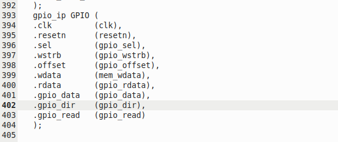

> The `IO_rdata` mux does **not** need to change — offset decoding happens entirely inside `gpio_ip.v`. The mux still just checks `mem_wordaddr[IO_GPIO_bit]` to select `gpio_rdata`.

---

## Step 4: Software Validation

### 4.1 — Address Calculation

The three registers live at consecutive word addresses within the GPIO IP's slot:

| Register | Offset | Byte Address | `mem_addr[3:2]` |
|----------|--------|-------------|-----------------|
| `GPIO_DATA` | `0x00` | `0x400020` | `2'b00` |
| `GPIO_DIR`  | `0x04` | `0x400024` | `2'b01` |
| `GPIO_READ` | `0x08` | `0x400028` | `2'b10` |

In `io.h`, peripheral offsets use `(1 << bit) << 2`. For GPIO (bit 3): `(1<<3)<<2 = 32`. Each register then adds its word offset × 4:

```c
#define IO_GPIO_DATA  32   // base: 0x400020
#define IO_GPIO_DIR   36   // base + 4: 0x400024
#define IO_GPIO_READ  40   // base + 8: 0x400028
```

---

### 4.2 — Write the C Test Program

```bash
cd ~/vsdfpga_labs/basicRISCV/Firmware
gedit gpio_test.c
```

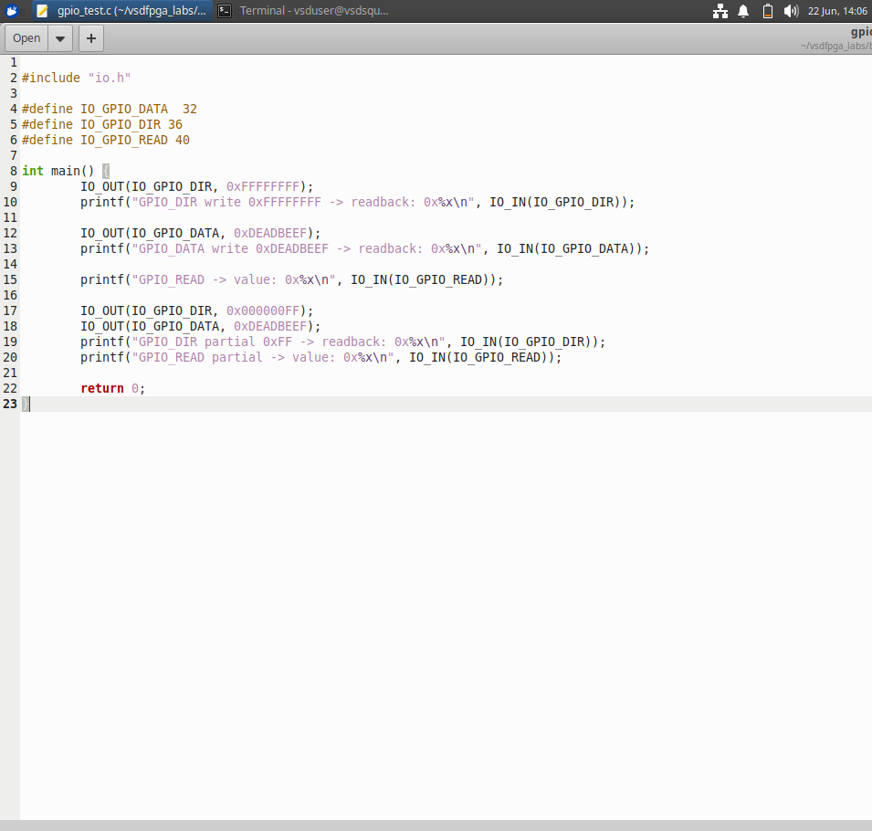

---

### 4.3 — Compile the Firmware

```bash
cd ~/vsdfpga_labs/basicRISCV/Firmware
make gpio_test.bram.hex
```

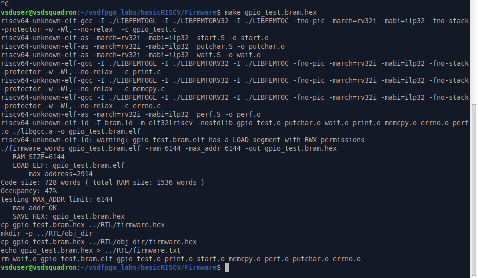

The Makefile handles the full bare-metal pipeline:
1. Cross-compile `gpio_test.c` with `riscv64-unknown-elf-gcc`
2. Link with startup code (`start.S`, `putchar.S`, etc.)
3. Convert ELF → hex via `firmware_words`
4. Auto-copy `gpio_test.bram.hex` → `../RTL/firmware.hex`

**BRAM occupancy: 47%** (up from 45% in Task-4 — the extra registers add a small code footprint)

---

### 4.4 — Run the Simulation

```bash
cd ~/vsdfpga_labs/basicRISCV/RTL
iverilog -g2012 -DBENCH -o gpio_sim riscv.v bench.v
vvp gpio_sim
```

> **Note:** `gpio_ip.v` is not listed separately — `riscv.v` already includes it internally via `` `include "gpio_ip.v" ``. The `-DBENCH` flag enables the UART `$write` block so `printf` output appears in the terminal.

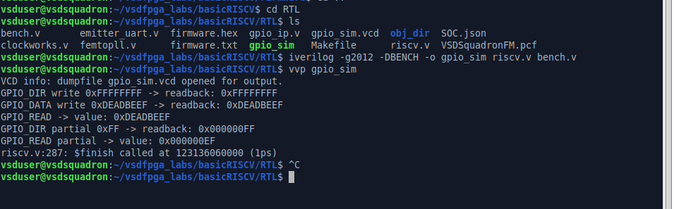

```
GPIO_DIR  write 0xFFFFFFFF -> readback: 0xFFFFFFFF
GPIO_DATA write 0xDEADBEEF -> readback: 0xDEADBEEF
GPIO_READ              -> value: 0xDEADBEEF
GPIO_DIR  partial 0xFF -> readback: 0x000000FF
GPIO_READ partial      -> value: 0x000000EF
$finish called at 123136060000 (1ps)
```

All 5 tests match expected values. The direction mask (`0x000000FF & 0xDEADBEEF = 0x000000EF`) proves the `GPIO_READ` logic is working correctly.

---

### 4.5 — GTKWave Waveform Analysis

```bash
gtkwave gpio_sim.vcd
```

Two views were captured — one for each write operation — to clearly show offset-based register selection.

**View 1 — Offset `2'b00` (writing `GPIO_DATA`):**

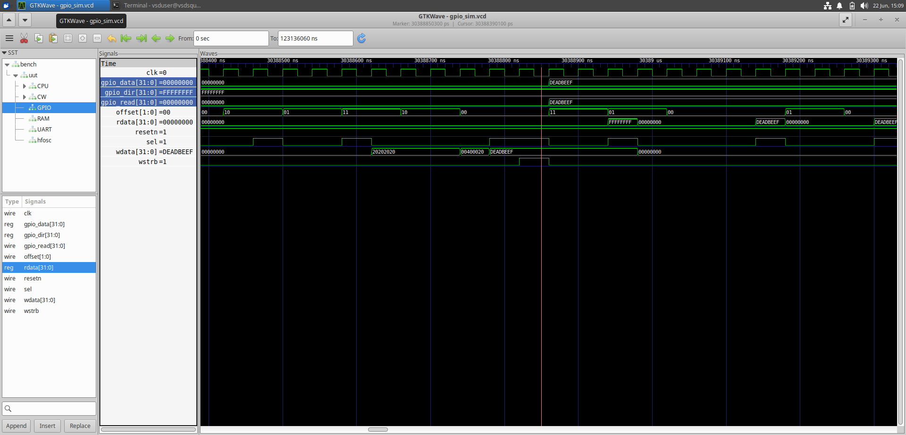

At this timestamp:
- `offset[1:0] = 00` → `GPIO_DATA` selected
- `wdata = DEADBEEF`, `wstrb = 1`, `sel = 1`
- `gpio_data` updates to `DEADBEEF`
- `gpio_dir = FFFFFFFF` (already written)
- `gpio_read = DEADBEEF` (= `DEADBEEF & FFFFFFFF`)

---

**View 2 — Offset `2'b01` (writing `GPIO_DIR`):**

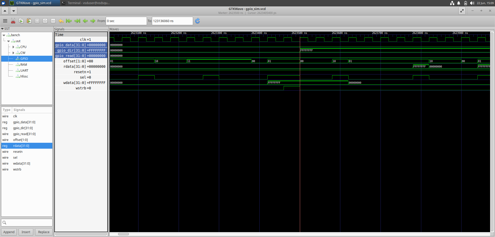

At this timestamp:
- `offset[1:0] = 01` → `GPIO_DIR` selected
- `wdata = FFFFFFFF`, `wstrb = 1`, `sel = 1`
- `gpio_dir` updates to `FFFFFFFF`
- `gpio_data` is unchanged at `00000000`
- `gpio_read = 00000000` (= `00000000 & FFFFFFFF`, data not yet written)

---

## 📋 Submission Answers

### How Address Offsets Are Decoded

```
CPU accesses 0x400020  → mem_addr[3:2] = 2'b00 → GPIO_DATA
CPU accesses 0x400024  → mem_addr[3:2] = 2'b01 → GPIO_DIR
CPU accesses 0x400028  → mem_addr[3:2] = 2'b10 → GPIO_READ
```

The SoC (`riscv.v`) routes the 2-bit offset as:
```verilog
wire [1:0] gpio_offset = mem_addr[3:2];
```
This wire goes directly into `gpio_ip.v` as the `offset` port. All decoding happens **inside the IP** — the SoC mux only checks whether GPIO is selected at all (`mem_wordaddr[IO_GPIO_bit]`), not which sub-register.

### How Direction Affects Behavior

`GPIO_READ` is computed combinationally:
```verilog
assign gpio_read = gpio_data & gpio_dir;
```

| Bit in `GPIO_DIR` | Effect on that bit in `GPIO_READ` |
|--------------------|----------------------------------|
| `1` (output)       | `GPIO_READ[bit] = GPIO_DATA[bit]` — driven value visible |
| `0` (input)        | `GPIO_READ[bit] = 0` — pin masked, reads as 0 |

This is the standard real-world GPIO peripheral behavior — you can't "read back" a value on a pin that's configured as input unless the hardware has a separate pin-state capture path.

### What Was Validated

- ✅ `GPIO_DIR = 0xFFFFFFFF` → readback `0xFFFFFFFF`
- ✅ `GPIO_DATA = 0xDEADBEEF` → readback `0xDEADBEEF`
- ✅ `GPIO_READ` = `0xDEADBEEF` (full mask — all bits output)
- ✅ `GPIO_DIR = 0x000000FF` (partial) → readback `0x000000FF`
- ✅ `GPIO_READ` = `0x000000EF` (correctly masked: `DEADBEEF & 000000FF`)
- ✅ GTKWave confirms `offset` selects the correct register on every access
- ✅ Program completed normally — `$finish` called, no hangs

---

## 📊 Results Summary

| Step | Status |
|------|--------|
| Step 1: Study Task-4 GPIO IP — identify what to extend | ✅ Done |
| Step 2: Implement multi-register `gpio_ip.v` — 3 registers, offset decoding | ✅ Done |
| Step 2: Verify on EDA Playground — all 5 tests pass | ✅ Done |
| Step 3: Integrate into `riscv.v` — new wires + updated instantiation | ✅ Done |
| Step 4: Write `gpio_test.c` — direction, data, readback | ✅ Done |
| Step 4: Compile firmware — `make gpio_test.bram.hex` (47% occupancy) | ✅ Done |
| Step 4: Simulate — `iverilog` + `vvp` — all 5 outputs correct | ✅ Done |
| Step 4: GTKWave — offset-00 and offset-01 views captured | ✅ Done |
| Step 5: Hardware validation (FPGA board) | ⚠️ Skipped — board not available |

---

## 📁 Files Created / Modified

| File | Location | Change |
|------|----------|--------|
| `gpio_ip.v` | `RTL/` | Modified — added `offset`, `gpio_data`, `gpio_dir`, `gpio_read` ports + 3-register logic |
| `riscv.v` | `RTL/` | Modified — added `gpio_offset` wire, updated GPIO wire declarations and instantiation |
| `gpio_test.c` | `Firmware/` | Modified — added `IO_GPIO_DATA`, `IO_GPIO_DIR`, `IO_GPIO_READ` defines and 5 test cases |
| `bench.v` | `RTL/` | Unchanged — same testbench stubs from Task-4 work correctly |

---

</details>

---

<details>
<summary><b>Task-6:</b> SPI Master IP — Real Peripheral IP Development (Core Contributor Task)</summary>
<br>

---

## 🎯 Objective

Design, integrate, and validate a **minimal SPI Master IP** as a real memory-mapped peripheral inside the RISC-V SoC — the same way peripheral IPs are owned and built in semiconductor and FPGA teams.

**IP Name:** SPI Master (Single-Byte, Mode 0)

This IP allows the RISC-V CPU to:
- Configure SPI clock speed via a clock divider
- Transmit an 8-bit byte over MOSI
- Receive an 8-bit byte over MISO simultaneously
- Monitor transfer status (BUSY / DONE) via a status register

**SPI Mode 0 (CPOL=0, CPHA=0):**
- SCLK idles **low**
- Data shifts out on **falling edge** (MOSI)
- Data sampled on **rising edge** (MISO)
- Exactly **8 bits** per transfer

---

## 🖥️ Environment

| Tool | Purpose |
|------|---------|
| Oracle VirtualBox (Ubuntu) | Local development machine |
| `gedit` | RTL and firmware editing |
| `riscv64-unknown-elf-gcc` | RISC-V cross-compiler |
| `iverilog -g2012` + `vvp` | Verilog simulation |
| `gtkwave` | Waveform viewer |

**Working directories:**
- RTL: `~/vsdfpga_labs/basicRISCV/RTL/`
- Firmware: `~/vsdfpga_labs/basicRISCV/Firmware/`

---

## Step 1: Register Map

### 1.1 — Base Address

`IO_SPI_bit = 4` → base offset = `(1 << 4) << 2 = 64` → **SPI Base Address = `0x400040`**

This follows the same 1-hot addressing pattern used by all peripherals in this SoC.

### 1.2 — Register Map

| Offset | Name | Address | R/W | Bits | Description |
|--------|------|---------|-----|------|-------------|
| `0x00` | `CTRL` | `0x400040` | R/W | [0]=EN, [1]=START, [15:8]=CLKDIV | Control register |
| `0x04` | `TXDATA` | `0x400044` | W | [7:0] | Byte to transmit |
| `0x08` | `RXDATA` | `0x400048` | R | [7:0] | Byte received from last transfer |
| `0x0C` | `STATUS` | `0x40004C` | R/W | [0]=BUSY, [1]=DONE | Transfer status |

### 1.3 — Register Bit Details

**CTRL (`0x00`):**
- Bit `[0]` — `EN`: Enable the SPI block (`1` = enabled)
- Bit `[1]` — `START`: Writing `1` triggers a transfer if not busy; **auto-clears internally** (not stored as a register bit)
- Bits `[15:8]` — `CLKDIV`: SCLK toggles every `(CLKDIV+1)` system clock cycles

**TXDATA (`0x04`):**
- Bits `[7:0]` — byte to transmit; writing loads the TX shift register

**RXDATA (`0x08`):**
- Bits `[7:0]` — received byte from the last completed transfer; **read-only**

**STATUS (`0x0C`):**
- Bit `[0]` — `BUSY`: `1` while transfer is in progress
- Bit `[1]` — `DONE`: `1` when transfer finishes; **write-1-to-clear**

### 1.4 — Offset Decoding

`mem_addr[3:2]` selects which register is accessed within the SPI IP:

| `mem_addr[3:2]` | Register |
|-----------------|---------|
| `2'b00` | CTRL |
| `2'b01` | TXDATA |
| `2'b10` | RXDATA |
| `2'b11` | STATUS |

---

## Step 2: RTL Implementation — `spi_master.v`

The SPI Master IP was written as a clean, synchronous Verilog module with:
- No hard-coded magic values (all parameterized via `CLKDIV`)
- Proper active-low reset behavior
- Three clearly separated always blocks (write logic, state machine, read logic)

```bash
cd ~/vsdfpga_labs/basicRISCV/RTL
gedit spi_master.v
```

### 2.1 — Module Ports and Internal Registers

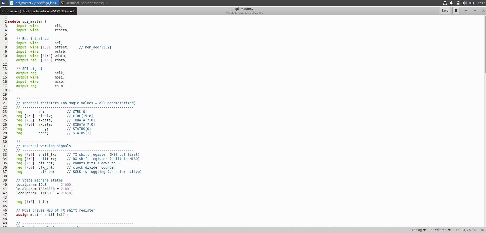

**Bus interface ports** (same pattern as `gpio_ip.v`):
- `sel` — this IP is selected by the CPU
- `offset[1:0]` — which register (`mem_addr[3:2]`)
- `wstrb` — CPU is writing
- `wdata[31:0]` — data from CPU
- `rdata[31:0]` — data back to CPU

**SPI signal ports:**
- `sclk` — SPI clock output
- `mosi` — data out to slave (driven by `shift_tx[7]`)
- `miso` — data in from slave
- `cs_n` — chip select, active low

**Internal registers:**
- `en`, `clkdiv` — stored from CTRL
- `txdata`, `rxdata` — TX byte to send, RX byte received
- `busy`, `done` — status flags
- `shift_tx[7:0]` — TX conveyor belt (MSB shifts out first on MOSI)
- `shift_rx[7:0]` — RX conveyor belt (MISO bits shift in)
- `bit_cnt[2:0]` — counts 7 down to 0 (8 bits per transfer)
- `clk_cnt[7:0]` — counts up to `clkdiv` to generate SCLK

**State machine states:**
```verilog
localparam IDLE     = 2'b00;
localparam TRANSFER = 2'b01;
localparam FINISH   = 2'b10;
```

**MOSI assignment — combinational:**
```verilog
assign mosi = shift_tx[7];   // MSB of TX shift register always drives MOSI
```

---

### 2.2 — Register Write Logic

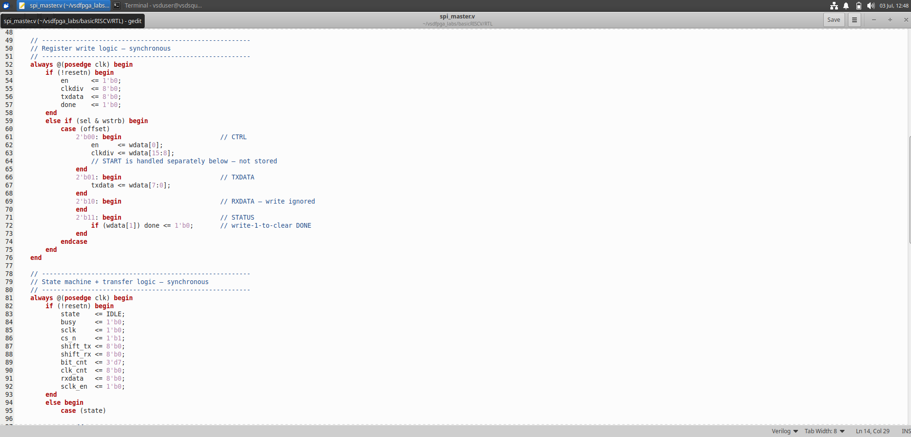

```verilog
always @(posedge clk) begin
    if (!resetn) begin
        en <= 0; clkdiv <= 0; txdata <= 0; done <= 0;
    end
    else if (sel & wstrb) begin
        case (offset)
            2'b00: begin en <= wdata[0]; clkdiv <= wdata[15:8]; end  // CTRL
            2'b01: txdata <= wdata[7:0];                              // TXDATA
            2'b10: /* RXDATA write ignored */ ;
            2'b11: if (wdata[1]) done <= 0;                           // clear DONE
        endcase
    end
end
```

> **Key design decision:** `START` is **not stored** as a register bit. It is detected as a live pulse in the state machine — storing it would risk re-triggering the transfer on every clock cycle.

---

### 2.3 — State Machine + Transfer Logic

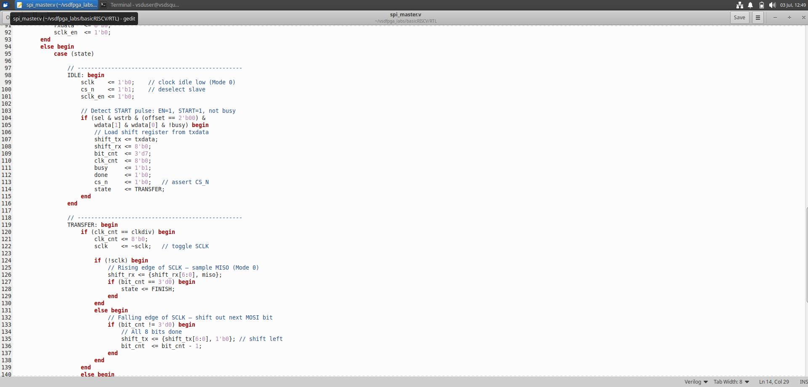

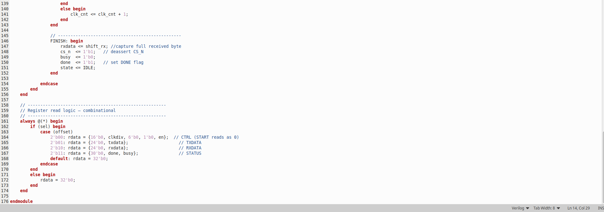

**IDLE state:**
- SCLK idles low (Mode 0), CS_N high (slave deselected)
- Detects `START` pulse: `sel & wstrb & offset==CTRL & EN=1 & START=1 & !busy`
- On detection: loads `shift_tx` from `txdata`, asserts `cs_n=0`, sets `busy=1`, moves to TRANSFER

**TRANSFER state — SPI Mode 0 timing:**
```
SCLK:   _____|‾‾‾‾‾|_____|‾‾‾‾‾|_____ (toggles every CLKDIV+1 cycles)
              ↑     ↓     ↑     ↓
           rising  falling
           MISO    MOSI
           sample  shift
```
- **Rising edge** (`!sclk` before toggle): sample MISO into `shift_rx`; if `bit_cnt==0`, go to FINISH
- **Falling edge** (`sclk` before toggle): shift `shift_tx` left if `bit_cnt != 0`, decrement `bit_cnt`

**FINISH state:**
- Copies `shift_rx` into `rxdata`
- Deasserts `cs_n=1`, clears `busy=0`, sets `done=1`
- Returns to IDLE

**Read logic — combinational:**
```verilog
2'b00: rdata = {16'b0, clkdiv, 6'b0, 1'b0, en};  // CTRL
2'b01: rdata = {24'b0, txdata};                    // TXDATA
2'b10: rdata = {24'b0, rxdata};                    // RXDATA
2'b11: rdata = {30'b0, done, busy};                // STATUS
```

---

## Step 3: SoC Integration

Four targeted edits were made to `riscv.v`. The `spi_master.v` file was also added to the include list.

### 3.1 — Add `include` at Top of `riscv.v`

```verilog
`include "clockworks.v"
`include "emitter_uart.v"
`include "gpio_ip.v"
`include "spi_master.v"    // ← NEW
```

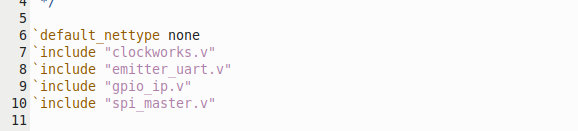

---

### 3.2 — Add `IO_SPI_bit` Localparam

```verilog
localparam IO_LEDS_bit     = 0;
localparam IO_UART_DAT_bit = 1;
localparam IO_UART_CNTL_bit= 2;
localparam IO_GPIO_bit     = 3;
localparam IO_SPI_bit      = 4;  // ← NEW SPI Master IP
```

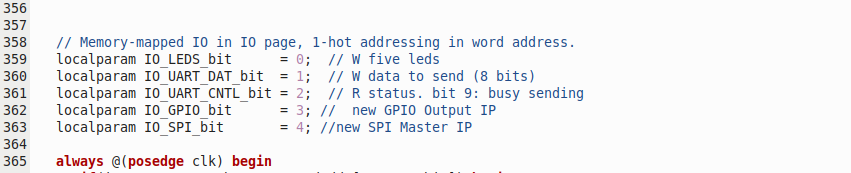

---

### 3.3 — Declare SPI Wires

```verilog
//---------SPI Signals---------------
wire        spi_sel    = isIO & mem_wordaddr[IO_SPI_bit];
wire [1:0]  spi_offset = mem_addr[3:2];
wire [31:0] spi_rdata;
wire        spi_sclk;
wire        spi_mosi;
wire        spi_miso;
wire        spi_cs_n;
```

`spi_sel` goes high only when the CPU addresses IO bit 4 — the SPI IP's exclusive slot. `spi_rdata` is driven by the module's `rdata` output port — no separate `spi_wdata` is needed; the shared `mem_wdata` bus passes directly into the module.

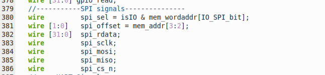

---

### 3.4 — Instantiate SPI Module + Extend IO_rdata Mux

```verilog
spi_master SPI (
    .clk    (clk),
    .resetn (resetn),
    .sel    (spi_sel),
    .offset (spi_offset),
    .wstrb  (mem_wstrb),
    .wdata  (mem_wdata),
    .rdata  (spi_rdata),
    .sclk   (spi_sclk),
    .mosi   (spi_mosi),
    .miso   (spi_miso),
    .cs_n   (spi_cs_n)
);

wire [31:0] IO_rdata =
    mem_wordaddr[IO_UART_CNTL_bit] ? {22'b0, !uart_ready, 9'b0} :
    mem_wordaddr[IO_GPIO_bit]       ? gpio_rdata :
    mem_wordaddr[IO_SPI_bit]        ? spi_rdata  :   // ← NEW
                                      32'b0;
```

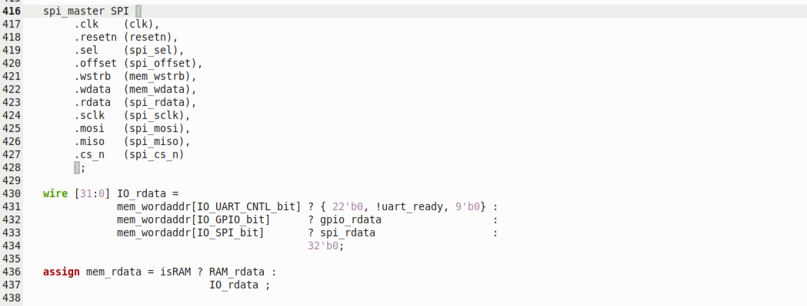

---

## Step 4: Software Validation

### 4.1 — Address Calculation

| Register | C Define | Offset | Byte Address |
|----------|----------|--------|-------------|
| `CTRL` | `IO_SPI_CTRL = 64` | `0x00` | `0x400040` |
| `TXDATA` | `IO_SPI_TXDATA = 68` | `0x04` | `0x400044` |
| `RXDATA` | `IO_SPI_RXDATA = 72` | `0x08` | `0x400048` |
| `STATUS` | `IO_SPI_STATUS = 76` | `0x0C` | `0x40004C` |

Pattern: `IO_SPI_bit=4` → base = `(1<<4)<<2 = 64`; each register adds `+4`.

---

### 4.2 — Write `spi_test.c`

```bash
cd ~/vsdfpga_labs/basicRISCV/Firmware
gedit spi_test.c
```

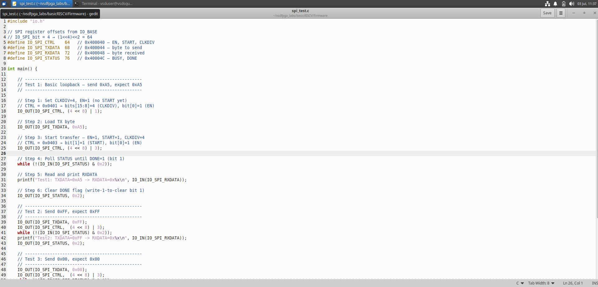

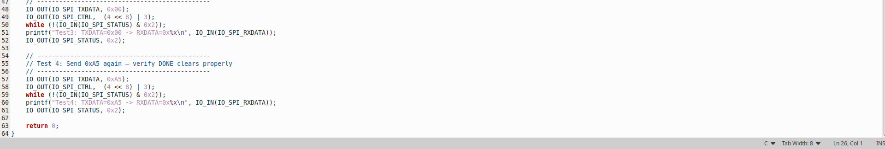

**Software flow for each test:**
```c
// 1. Set CLKDIV=4, EN=1
IO_OUT(IO_SPI_CTRL, (4 << 8) | 1);

// 2. Load TX byte
IO_OUT(IO_SPI_TXDATA, 0xA5);

// 3. Start transfer (EN=1, START=1, CLKDIV=4)
IO_OUT(IO_SPI_CTRL, (4 << 8) | 3);

// 4. Poll STATUS until DONE=1 (bit 1)
while (!(IO_IN(IO_SPI_STATUS) & 0x2));

// 5. Read and print RXDATA
printf("Test1: TXDATA=0xA5 -> RXDATA=0x%x\n", IO_IN(IO_SPI_RXDATA));

// 6. Clear DONE flag (write-1-to-clear)
IO_OUT(IO_SPI_STATUS, 0x2);
```

---

### 4.3 — Compile the Firmware

```bash
cd ~/vsdfpga_labs/basicRISCV/Firmware
make spi_test.bram.hex
```

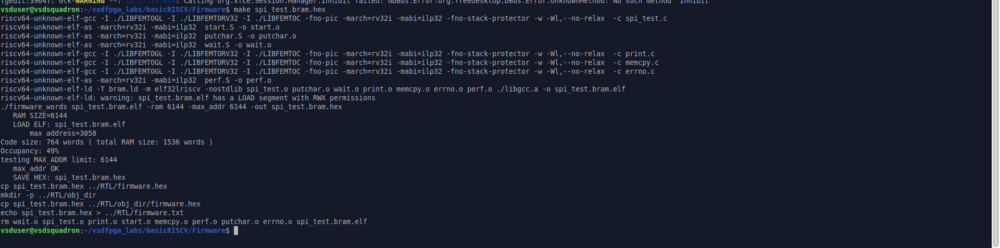

**BRAM occupancy: 49%** — the polling loop and 4 test cases fit comfortably within the 1536-word BRAM.

---

### 4.4 — Add Loopback to `bench.v`

For simulation, `MISO` is tied directly to `MOSI` — whatever is transmitted comes straight back, proving TX and RX logic simultaneously.

```bash
gedit ~/vsdfpga_labs/basicRISCV/RTL/bench.v
```

```verilog
SOC uut(
    .RESET(RESET), .LEDS(LEDS), .RXD(RXD), .TXD(TXD)
);

assign uut.spi_miso = uut.spi_mosi;   // ← loopback: MISO tied to MOSI
```

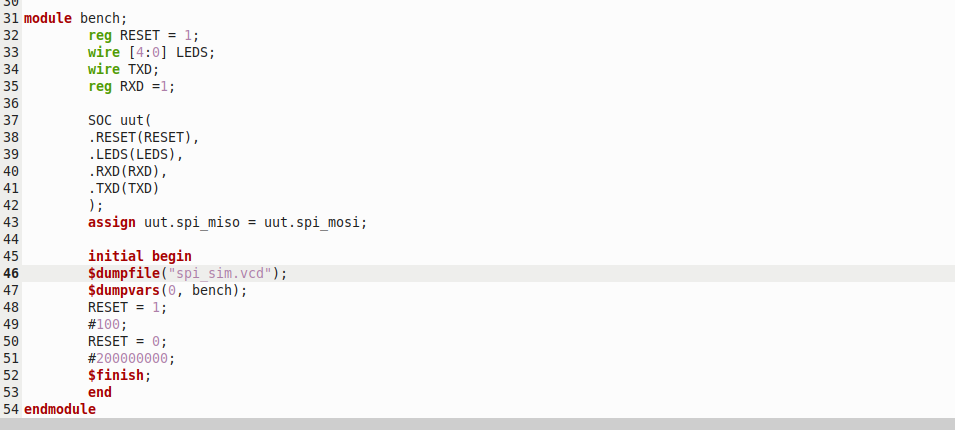

---

### 4.5 — Run the Simulation

```bash
cd ~/vsdfpga_labs/basicRISCV/RTL
iverilog -g2012 -DBENCH -o spi_sim riscv.v bench.v
vvp spi_sim
```

> `spi_master.v` is not listed separately — `riscv.v` includes it internally via `` `include "spi_master.v" ``. The `-DBENCH` flag enables the UART `$write` block so `printf` output appears in the terminal.

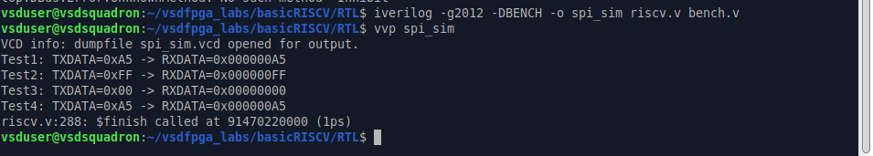

```
Test1: TXDATA=0xA5 -> RXDATA=0x000000A5
Test2: TXDATA=0xFF -> RXDATA=0x000000FF
Test3: TXDATA=0x00 -> RXDATA=0x00000000
Test4: TXDATA=0xA5 -> RXDATA=0x000000A5
$finish called at 91470220000 (1ps)
```

All 4 loopback tests pass — TXDATA equals RXDATA in every case. ✅

---

## Step 5: GTKWave Waveform Analysis

```bash
gtkwave spi_sim.vcd
```

### 5.1 — Bit-by-Bit Transfer View (Test 1 — 0xA5)

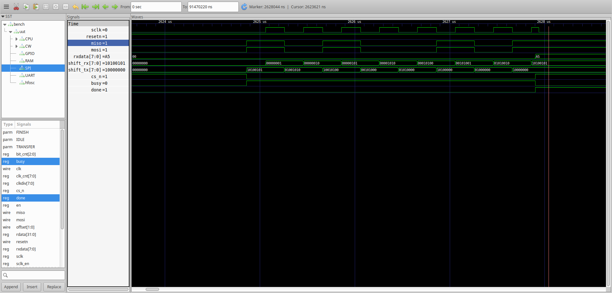

`0xA5 = 1010 0101` transmitted MSB first. The waveform shows:

| Signal | What you see | What it proves |
|--------|-------------|----------------|
| `sclk` | 8 clean pulses | Clock divider working correctly |
| `mosi` | matches `1010 0101` bit pattern | TX shift register shifting MSB first |
| `miso` | identical to `mosi` | Loopback connected, MISO sampled correctly |
| `shift_rx` | builds `00000001 → 00000010 → ... → 10100101` | MISO sampled on every rising edge |
| `shift_tx` | empties `10100101 → 01001010 → ... → 10000000` | Shift left each falling edge |
| `rxdata` | updates to `A5` after 8th bit | Final capture in FINISH state correct |
| `cs_n` | low during transfer | Slave selected for full duration |
| `busy` | goes `0` after transfer | State machine reached FINISH |
| `done` | goes `1` after transfer | DONE flag set for CPU to poll |

**`shift_rx` building up step by step:**
```
00000001 → 00000010 → 00000101 → 00001010 →
00010100 → 00101001 → 01010010 → 10100101  (= 0xA5 ✅)
```

---

### 5.2 — Test 2 Transfer View (0xFF)

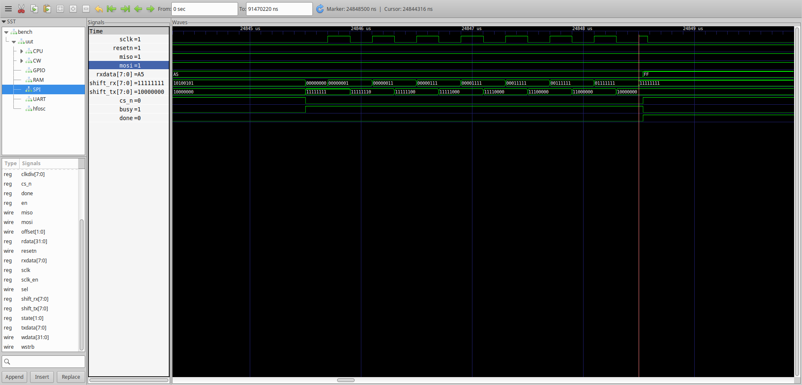

`0xFF = 1111 1111` — all bits high. The waveform shows:
- `mosi = 1` continuously for all 8 bits
- `shift_rx` fills with ones: `00000001 → 00000011 → ... → 11111111`
- `rxdata` updates to `FF` at the end
- `cs_n` goes low for the full transfer, high on completion
- `busy = 1` during transfer, drops to `0` in FINISH

---

## 📋 Integration Approach

### How Address Decoding Works

```
CPU accesses 0x400040  →  mem_addr[22]=1 (isIO)
                       →  mem_wordaddr[4]=1 (IO_SPI_bit)
                       →  spi_sel=1 (SPI IP selected)
                       →  mem_addr[3:2] = 2'b00 → CTRL register
```

```
CPU accesses 0x400048  →  spi_sel=1
                       →  mem_addr[3:2] = 2'b10 → RXDATA register
```

The SoC's `IO_rdata` mux checks only **which IP** is selected (`mem_wordaddr[IO_SPI_bit]`). All **sub-register** selection happens inside `spi_master.v` via the `offset` port — keeping the SoC integration clean.

### Why START is Not a Stored Register

Storing `START` would mean the bit stays `1` across clock cycles, re-triggering the transfer every cycle. Instead, START is detected as a **live pulse** — the state machine checks `wdata[1]` at the exact clock cycle the CPU writes CTRL, then immediately transitions to TRANSFER. This is a critical timing distinction for one-shot trigger logic.

---

## 📊 Results Summary

| Step | Status |
|------|--------|
| Step 1: Register map — 4 registers, base `0x400040`, offset decoding | ✅ Done |
| Step 2: `spi_master.v` — FSM, clock divider, shift registers, read/write logic | ✅ Done |
| Step 3: `riscv.v` integration — localparam, wires, instantiation, mux | ✅ Done |
| Step 4: `spi_test.c` — 4 loopback tests, poll DONE, UART output | ✅ Done |
| Step 4: `make spi_test.bram.hex` — 49% BRAM occupancy | ✅ Done |
| Step 5: Simulation — all 4 tests pass (`0xA5`, `0xFF`, `0x00`, `0xA5`) | ✅ Done |
| Step 5: GTKWave — bit-by-bit shift verified, cs_n, busy, done confirmed | ✅ Done |
| Hardware validation (FPGA board) | ⚠️ Skipped — board not available |

---

## 📁 Files Created / Modified

| File | Location | Change |
|------|----------|--------|
| `spi_master.v` | `RTL/` | **New** — complete SPI Master IP RTL |
| `riscv.v` | `RTL/` | Modified — `IO_SPI_bit`, SPI wires, instantiation, `IO_rdata` mux, include |
| `spi_test.c` | `Firmware/` | **New** — 4-test C validation program |
| `bench.v` | `RTL/` | Modified — loopback `assign uut.spi_miso = uut.spi_mosi` |

---

## 📂 Submission Structure

```
ip/spi_master/
├── rtl/
│   └── spi_master.v
├── test/
│   └── spi_test.c
└── README.md
```

---

</details>

---
